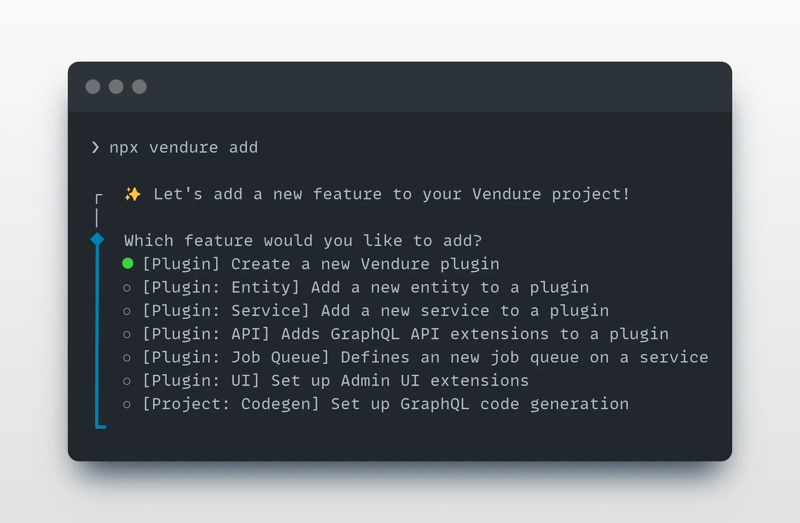
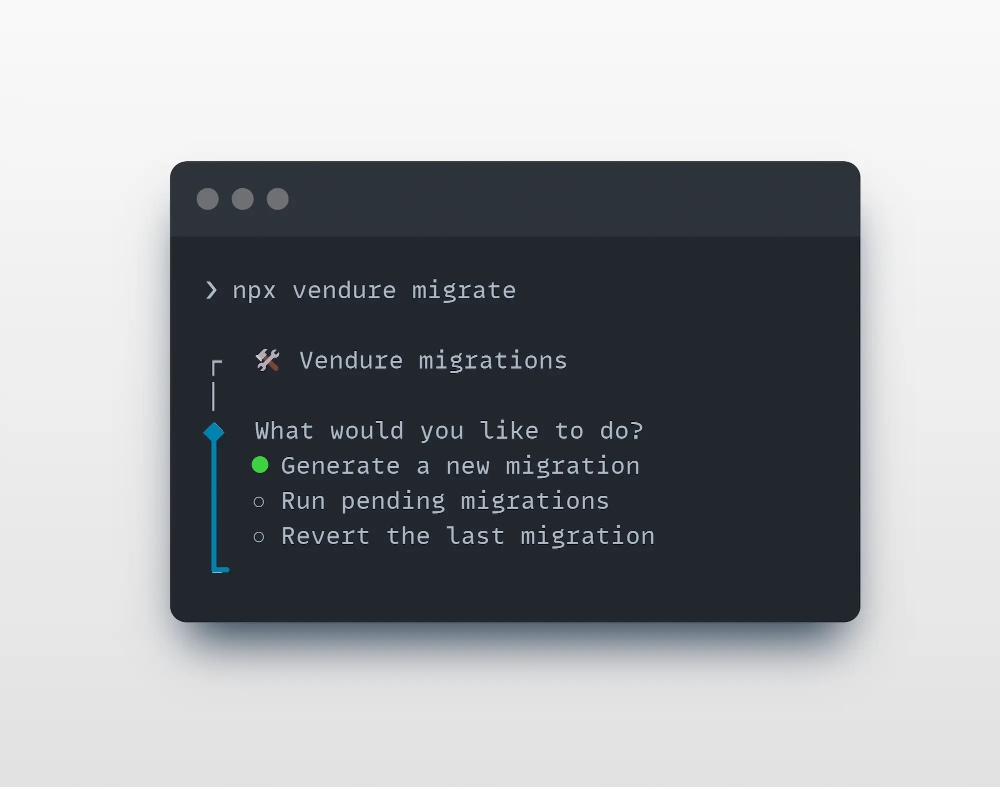
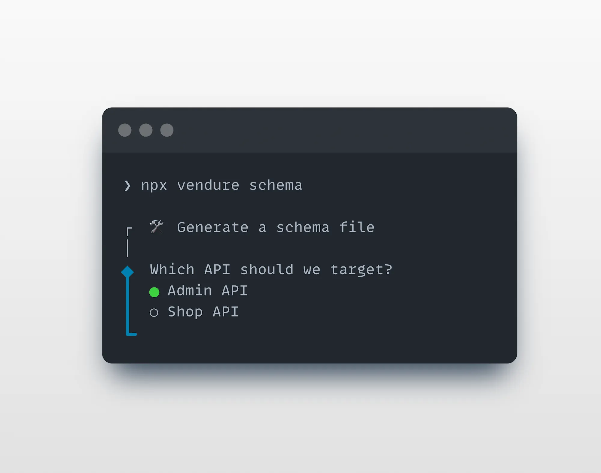

The Vendure CLI is a command-line tool for boosting your productivity as a developer by automating common tasks
such as creating new plugins, entities, API extensions and more.

It is much more than just a scaffolding tool - it is able to analyze your project and intelligently modify your existing
codebase to integrate new functionality.

## Installation

:::info
The Vendure CLI comes installed with a new Vendure project by default from v2.2.0+
:::

To manually install the CLI, run:

```bash
npm install -D @vendure/cli
```

## Interactive vs Non-Interactive Mode

The Vendure CLI supports both **interactive** and **non-interactive** modes:

- **Interactive mode**: Provides guided prompts and menus for easy use during development
- **Non-interactive mode**: Allows direct command execution with arguments and options, perfect for automation, CI/CD, and AI agents

For guidance on using the CLI together with project instructions for AI coding agents, see the
[AI-assisted development guide](/guides/developer-guide/ai-assisted-development/).

## The Add Command

The `add` command is used to add new entities, resolvers, services, plugins, and more to your Vendure project.

### Interactive Mode

From your project's **root directory**, run:

```bash
npx vendure add
```



The CLI will guide you through the process of adding new functionality to your project.

The `add` command is much more than a simple file generator. It is able to
analyze your project source code to deeply understand and correctly update your project files.

### Non-Interactive Mode

For automation or when you know exactly what you need to add, you can use the non-interactive mode with specific arguments and options:

```bash
# Create a new plugin
npx vendure add -p MyPlugin

# Add an entity to a plugin
npx vendure add -e MyEntity --selected-plugin MyPlugin

# Add an entity with features
npx vendure add -e MyEntity --selected-plugin MyPlugin --custom-fields --translatable

# Add a service to a plugin
npx vendure add -s MyService --selected-plugin MyPlugin

# Add a service with specific type
npx vendure add -s MyService --selected-plugin MyPlugin --type entity

# Add job queue support to a plugin
npx vendure add -j MyPlugin --name my-job --selected-service MyService

# Add GraphQL codegen to a plugin
npx vendure add -c MyPlugin

# Add API extension to a plugin
npx vendure add -a MyPlugin --queryName getCustomData --mutationName updateCustomData

# Add Dashboard extensions to a plugin
npx vendure add -d MyPlugin

# Use custom config file
npx vendure add -p MyPlugin --config ./custom-vendure.config.ts
```

#### Add Command Options

| Flag | Long Form                  | Description                        | Example                                                                  |
| ---- | -------------------------- | ---------------------------------- | ------------------------------------------------------------------------ |
| `-p` | `--plugin <n>`             | Create a new plugin                | `vendure add -p MyPlugin`                                                |
| `-e` | `--entity <n>`             | Add a new entity to a plugin       | `vendure add -e MyEntity --selected-plugin MyPlugin`                     |
| `-s` | `--service <n>`            | Add a new service to a plugin      | `vendure add -s MyService --selected-plugin MyPlugin`                    |
| `-j` | `--job-queue [plugin]`     | Add job queue support              | `vendure add -j MyPlugin --name job-name --selected-service ServiceName` |
| `-c` | `--codegen [plugin]`       | Add GraphQL codegen configuration  | `vendure add -c MyPlugin`                                                |
| `-a` | `--api-extension [plugin]` | Add API extension scaffold         | `vendure add -a MyPlugin --queryName getName --mutationName setName`     |
| `-d` | `--dashboard [plugin]`     | Add Dashboard extensions setup     | `vendure add -d MyPlugin`                                                |
|      | `--config <path>`          | Specify custom Vendure config file | `--config ./custom-config.ts`                                            |

#### Sub-options for specific commands

**Entity (`-e`) additional options:**

- `--selected-plugin <n>`: Name of the plugin to add the entity to (required)
- `--custom-fields`: Add custom fields support to the entity
- `--translatable`: Make the entity translatable

**Service (`-s`) additional options:**

- `--selected-plugin <n>`: Name of the plugin to add the service to (required)
- `--type <type>`: Type of service: basic or entity (default: basic)

**Job Queue (`-j`) additional options:**

- `--name <name>`: Name for the job queue (required)
- `--selected-service <name>`: Service to add the job queue to (required)

**API Extension (`-a`) additional options: (requires either)**

- `--queryName <n>`: Name for the GraphQL query
- `--mutationName <n>`: Name for the GraphQL mutation

:::info
**Validation**: Entity and service commands validate that the specified plugin exists in your project. If the plugin is not found, the command will list all available plugins in the error message. Both commands require the `--selected-plugin` parameter when running in non-interactive mode.
:::

## The Migrate Command

The `migrate` command is used to generate and manage [database migrations](/developer-guide/migrations) for your Vendure project.

### Interactive Mode

From your project's **root directory**, run:

```bash
npx vendure migrate
```



### Non-Interactive Mode

For migration operations, use specific arguments and options:

```bash
# Generate a new migration
npx vendure migrate -g my-migration-name

# Run pending migrations
npx vendure migrate -r

# Revert the last migration
npx vendure migrate --revert

# Generate migration with custom output directory
npx vendure migrate -g my-migration -o ./custom/migrations

# Generate a complete baseline migration against an empty shadow database
npx vendure migrate -g initial --from-empty
```

#### Migrate Command Options

| Flag | Long Form             | Description                            | Example                                           |
| ---- | --------------------- | -------------------------------------- | ------------------------------------------------- |
| `-g` | `--generate <name>`   | Generate a new migration               | `vendure migrate -g add-user-table`               |
| `-r` | `--run`               | Run all pending migrations             | `vendure migrate -r`                              |
|      | `--revert`            | Revert the last migration              | `vendure migrate --revert`                        |
| `-o` | `--output-dir <path>` | Custom output directory for migrations | `vendure migrate -g my-migration -o ./migrations` |
|      | `--from-empty`        | Generate a complete baseline migration by diffing against an empty [shadow database](/developer-guide/migrations/#generating-a-baseline-migration-for-an-existing-project) | `vendure migrate -g initial --from-empty` |

## The Schema Command

:::info
The `schema` command was added in Vendure v3.5
:::

The `schema` command allows you to generate a schema file for your Admin or Shop APIs, in either the GraphQL schema definition language (SDL)
or as JSON.

This is useful when integrating with GraphQL tooling such as your [IDE's GraphQL plugin](/getting-started/graphql-intro/#ide-plugins).

### Interactive Mode

From your project's **root directory**, run:

```bash
npx vendure schema
```



### Non-Interactive Mode

To automate or quickly generate a schema in one command

```bash
# Create a schema file in SDL format for the Admin API
npx vendure schema --api admin

# Create a JSON format schema of the Shop API
npx vendure schema --api shop --format json
```

#### Schema Command Options

| Flag | Long Form             | Description                                     | Example                                                        |
| ---- | --------------------- | ----------------------------------------------- | -------------------------------------------------------------- |
| `-a` | `--api <admin,shop>`  | Select the API (required)                       | `vendure schema --api admin`                                   |
| `-d` | `--dir <dir>`         | Select the output dir (defaults to current dir) | `vendure schema --api admin --dir ../..`                       |
| `-n` | `--file-name <name>`  | The name of the generated file                  | `vendure schema --api admin --file-name introspection.graphql` |
| `-f` | `--format <sdl,json>` | The output format (defaults to SDL)             | `vendure schema --api admin --format json`                     |

## The Doctor Command

:::info
The `doctor` command was added in Vendure v3.7
:::

The `doctor` command runs a series of diagnostic checks against your Vendure project and produces an
actionable report. It is useful for debugging a misbehaving project, verifying an upgrade, onboarding
a new machine, or as a guard rail in CI.

Unlike the other commands, `doctor` is **non-interactive only** - it runs all applicable checks and prints a report:

```bash
npx vendure doctor
```

### What gets checked

By default, the following checks run in order:

| Check            | What it verifies                                                                                                                                                |
| ---------------- | --------------------------------------------------------------------------------------------------------------------------------------------------------------- |
| **Project**      | Vendure project structure, config file discovery, package manager detection, lockfile consistency, and monorepo support.                                       |
| **Dependencies** | `@vendure/*` packages are on matching versions, no duplicate singleton dependencies (`graphql`, `typeorm`, `@nestjs/core`, `@nestjs/common`, `@apollo/server`), and that a database driver is installed. |
| **Config**       | Your config loads and validates via `preBootstrapConfig()` (custom fields, entities), and that plugin compatibility ranges are satisfied.                       |
| **Schema**       | The Admin API and Shop API GraphQL schemas build successfully, so all plugin extensions and custom field types compile.                                         |
| **Database**     | Database connectivity, using safe read-only overrides. Warns if `synchronize: true` is set.                                                                     |

The **Production** check is not run by default - enable it with `--profile production` (see below).

:::info
The checks are **dependency-ordered**. If the **Project** check fails, all later checks are skipped.
If the **Config** check fails, the **Schema**, **Database**, and **Production** checks are skipped, since
they all depend on a successfully loaded config.
:::

### Example output

```text
Vendure Doctor

Project         pass  Vendure config found at src/vendure-config.ts
Dependencies    pass  All dependency checks passed
Config          pass  Vendure config loaded and validated successfully
Schema          pass  Admin and Shop schemas generated successfully
Database        pass  Successfully connected to postgres database

Result: passed
```

Each check reports one of four statuses: `pass`, `warn`, `fail`, or `skip`.

### Running specific checks

Use `--check` to run only a subset of checks. The flag is variadic, so list the check names after it:

```bash
# Run only the dependencies and config checks
npx vendure doctor --check dependencies config
```

Valid check names are: `project`, `dependencies`, `config`, `schema`, `database`.

### Production profile

When preparing for a production deployment, run the production profile to surface unsafe settings:

```bash
npx vendure doctor --profile production
```

This adds a **Production** check that warns about settings such as `disableAuth`, default superadmin
credentials, a missing cookie secret, enabled introspection/playground/debug, overly broad CORS,
in-memory job queue/cache/session strategies, and missing asset storage.

### Using in CI

For CI pipelines, combine `--strict` with `--format json`. The `--strict` flag treats warnings as
failures, and the command exits with a non-zero code when the overall result is a failure - so a
warning will fail your build:

```bash
# Fail the build on any warning or failure, and emit machine-readable output
npx vendure doctor --strict --format json
```

#### Doctor Command Options

| Long Form           | Description                                                                            | Example                                       |
| ------------------- | ------------------------------------------------------------------------------------- | --------------------------------------------- |
| `--config <path>`   | Specify the path to a custom Vendure config file                                       | `vendure doctor --config ./src/my-config.ts`  |
| `--check <names...>` | Run specific checks only (`project`, `dependencies`, `config`, `schema`, `database`)  | `vendure doctor --check config schema`        |
| `--profile <name>`  | Run profile-specific checks (`production`)                                              | `vendure doctor --profile production`         |
| `--format <type>`   | Output format: `text` (default) or `json`                                              | `vendure doctor --format json`                |
| `--strict`          | Treat warnings as failures (useful for CI)                                             | `vendure doctor --strict`                     |

## The Console Command

The `console` command links a local Vendure application to a Project in Vendure Console. Run the command from a
Vendure project directory:

```bash
npx vendure console link
```

The CLI creates a short-lived request and opens Vendure Console in your browser. Sign in, select an active Project,
and approve the request. The CLI then writes `.vendure/project.json` in the resolved Vendure project.

The browser owns authentication and authorization. The CLI does not store your Console access token. The one-time
polling secret stays in memory and is not included in the browser URL, output, or manifest. If the browser cannot open,
the CLI prints the verification URL so that you can open it manually.

### Link status

Use `status` to validate and display the local link:

```bash
npx vendure console status
```

The output includes the Account, Project, schema version, protocol version, and local authentication state. This
command reads local state only. It does not contact Vendure Console.

### Unlink a project

Use `unlink` to remove the local manifest:

```bash
npx vendure console unlink
```

This command removes only `.vendure/project.json`. It does not delete the Console Project, revoke server-side
credentials, or change the completed link request.

### Project selection and confirmation

The CLI uses the nearest project that has a direct `@vendure/core` dependency. From a monorepo root, it uses the only
Vendure project under `packages`, `apps`, `libs`, `services`, or `modules`. If more than one project exists, select one:

```bash
npx vendure console status --project ./apps/server
```

Replacing or removing a manifest requires confirmation. In non-interactive environments, use `--force` to confirm the
specific action:

```bash
npx vendure console link --force
npx vendure console unlink --force
```

`--force` does not bypass ambiguous project selection or a manifest that belongs to another project root.

### Manifest and source control

The v1 manifest contains identity metadata only:

```json
{
    "schemaVersion": 1,
    "project": { "id": "<uuid>", "name": "<display name>" },
    "account": { "id": "<uuid>", "name": "<display name>" },
    "link": { "id": "<uuid>", "protocolVersion": 1 }
}
```

Commit `.vendure/project.json` so that the repository keeps its Project identity. Ignore all other `.vendure` files.
They are reserved for machine-local state and may contain secrets.

`vendure console link` updates the resolved project's `.gitignore` with these rules when they are missing:

```text
.vendure/*
!.vendure/project.json
```

The command normally changes no `.gitignore` file outside the project directory. One exception applies in a
monorepo: an ancestor rule such as `.vendure/` prevents Git from reading the project's `.gitignore`. The command
then adds rules for only the selected project to that ancestor file:

```text
!apps/vendure/.vendure/
apps/vendure/.vendure/*
!apps/vendure/.vendure/project.json
```

The original ancestor rule stays unchanged, and other projects remain ignored. The command reports the exact
`.gitignore` file that it changed.

### Console environments

The command uses `https://console.vendure.io` and `https://api.vendure.io` by default. To use a local Console
environment, set both link-specific variables:

```bash
VENDURE_CONSOLE_LINK_URL=http://localhost:3000 \
VENDURE_CONSOLE_LINK_API_URL=http://localhost:3001 \
npx vendure console link
```

The variables apply only to the unauthenticated Project Link exchange. They do not configure Console authentication,
Environment Credentials, Registry access, package downloads, or Vendure Cloud operations.

The CLI rejects partial endpoint configuration and URLs that contain credentials, paths, queries, or fragments. It
requires HTTPS except for `localhost`, `127.0.0.1`, and `::1`. The production Console and API origins must be used
together.

Before it contacts a custom remote environment, the CLI displays both origins and asks for confirmation. In a
non-interactive environment, pass `--allow-custom-console` to confirm them explicitly:

```bash
VENDURE_CONSOLE_LINK_URL=https://console.staging.example.com \
VENDURE_CONSOLE_LINK_API_URL=https://api.staging.example.com \
npx vendure console link --allow-custom-console
```

## Working in Monorepos

The Vendure CLI automatically supports monorepo structures where packages have their own `tsconfig.json` files that extend a shared base configuration.

### Requirements

For the CLI to work correctly in a monorepo, ensure that:

1. **Each package containing a Vendure config has its own `tsconfig.json`** that extends the root config
2. **Path mappings are defined in your root `tsconfig.json`**

### Example Setup

A typical monorepo structure:

```text
my-monorepo/
├── tsconfig.json             # Root config with path mappings
├── packages/
│   └── vendure-app/
│       ├── tsconfig.json     # Extends root config
│       └── src/
│           └── vendure-config.ts
└── libs/
    └── shared/
        └── src/
            └── index.ts
```

**Root `tsconfig.json`:**

```json
{
    "compilerOptions": {
        "baseUrl": ".",
        "paths": {
            "@my-org/shared": ["libs/shared/src/index.ts"]
        }
    }
}
```

**Package `packages/vendure-app/tsconfig.json`:**

```json
{
    "extends": "../../tsconfig.json",
    "compilerOptions": {
        "outDir": "./dist"
    }
}
```

### How It Works

When you run CLI commands, it:

1. Locates the nearest `tsconfig.json` by walking up from your Vendure config file
2. Resolves the `extends` chain to merge all configurations
3. Registers path mappings so imports like `@my-org/shared` resolve correctly

:::info
The CLI automatically detects your monorepo structure. No additional configuration flags are required as long as your `tsconfig.json` files are properly set up with `extends`.
:::

## Extending the CLI

Packages can add new top-level commands or replace built-in ones (for example overriding
`vendure dev`) by exporting a CLI plugin.

In the plugin package:

```ts
import { builtinCommands, defineCliPlugin } from '@vendure/cli';

export default defineCliPlugin({
    id: '@example/vendure-cli-plugin',
    commands: [
        {
            name: 'hello',
            description: 'A new command contributed by a plugin',
            action: async () => {
                console.log('hello');
                return 0;
            },
        },
        {
            name: 'dev',
            description: 'Replace or wrap the built-in dev command',
            action: async (target, options) => {
                // optional setup...
                return builtinCommands.dev.action(target, options);
            },
        },
    ],
});
```

Declare the entry point in that package's `package.json`:

```json
{
    "vendure": {
        "cliPlugin": "./dist/cli-plugin.js",
        "cliCommands": ["hello", "dev"]
    }
}
```

The optional `cliCommands` list lets the CLI give actionable errors for unknown
commands without loading the plugin.

### Explicit activation

The CLI discovers **direct** dependencies that declare `vendure.cliPlugin`, but
does **not** load them until they are listed in the project `package.json`:

```json
{
    "vendure": {
        "cli": {
            "plugins": ["@example/vendure-cli-plugin"]
        }
    }
}
```

Manage that list with:

```bash
npx vendure plugins
npx vendure plugins --json
npx vendure plugins add @example/vendure-cli-plugin
npx vendure plugins remove @example/vendure-cli-plugin
```

A package named in `plugins` must also be a direct project dependency.
Disabling a plugin is simply removing it from the list (`vendure plugins remove`).
Commands are registered in allowlist order (last listed wins when names collide).
Plugins can still call the original via `builtinCommands.<name>.action(...)`.

A listed plugin that cannot be resolved or loaded is skipped with an error on
stderr — the rest of the CLI (including `vendure plugins remove`) stays usable.

## Getting Help

To see all available commands and options:

```bash
npx vendure --help
npx vendure add --help
npx vendure migrate --help
npx vendure schema --help
npx vendure doctor --help
npx vendure console --help
npx vendure plugins --help
```
