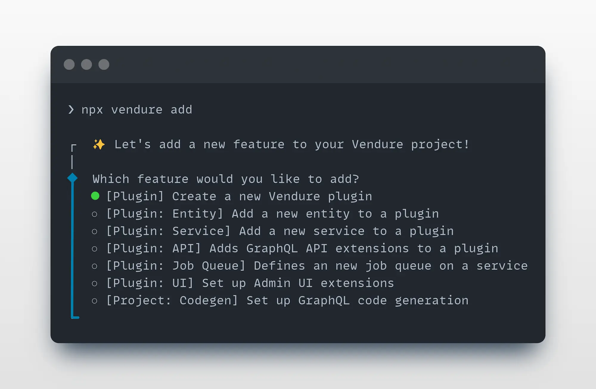
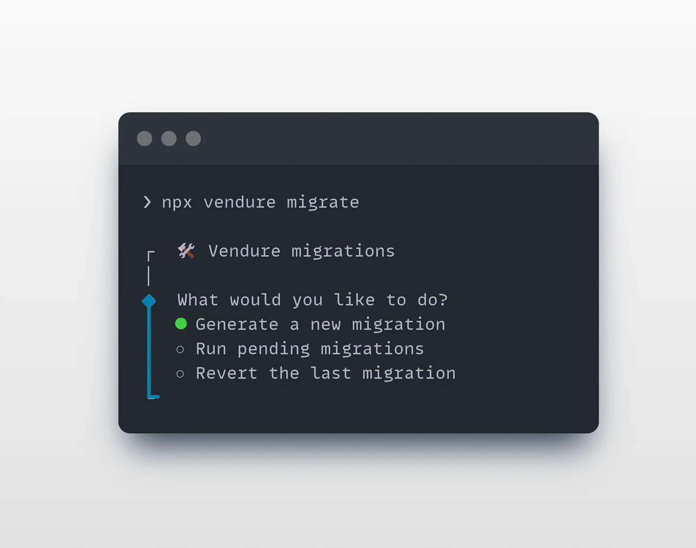
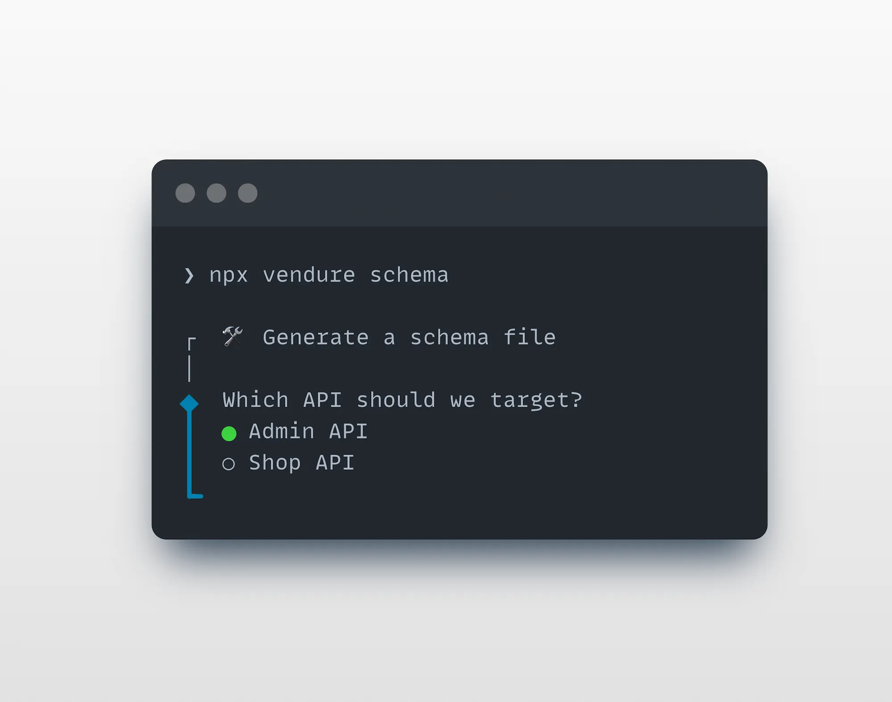

The Vendure CLI is a command-line tool for boosting your productivity as a developer by automating common tasks
such as creating new plugins, entities, API extensions and more.

It is much more than just a scaffolding tool - it is able to analyze your project and intelligently modify your existing
codebase to integrate new functionality.

## Installation

:::info
The Vendure CLI comes installed with a new Vendure project by default from v2.2.0+
:::

To manually install the CLI, run:

```bash
npm install -D @vendure/cli
```

## Interactive vs Non-Interactive Mode

The Vendure CLI supports both **interactive** and **non-interactive** modes:

- **Interactive mode**: Provides guided prompts and menus for easy use during development
- **Non-interactive mode**: Allows direct command execution with arguments and options, perfect for automation, CI/CD, and AI agents

For guidance on using the CLI together with project instructions for AI coding agents, see the
[AI-assisted development guide](/guides/developer-guide/ai-assisted-development/).

## The Dev Command

The `dev` command runs the server, worker and Dashboard in development mode. Use a target to run one process:

```bash
npx vendure dev
npx vendure dev server
npx vendure dev --project server
npx vendure dev server --project ./apps/backend
```

`server` in `vendure dev server` selects the server process. `--project <dir>` selects the project directory.
Relative project paths are resolved against the working directory. Entry files and the Vite config are resolved
from the selected project.

The command resolves the project in this order:

1. Use `--project <dir>` if supplied. The directory must have a `package.json` with `@vendure/core` in
   `dependencies` or `devDependencies`. An invalid path stops the command.
2. Use the working directory if its `package.json` depends on `@vendure/core`.
3. Search members declared in the working directory's `package.json` `workspaces` field. Both
   `["server"]` and `{ "packages": ["server"] }` are supported, with `*` wildcards such as `apps/*`.
4. Search immediate members of `packages`, `apps`, `libs`, `services` and `modules` in that order.

If more than one declared workspace member depends on `@vendure/core`, the command lists the candidates and
asks you to select one with `--project`. If no project is found, the error names the searched directory and
`--project`.

For a workspace with `"workspaces": ["server"]`, run `vendure dev` or `vendure dev server` from the root.
Running from inside `server/` also works.

The CLI reads `--project` before it loads plugins and parses the full `dev` command. It reads the plugin
allowlist from the selected project's `package.json` and resolves plugin packages from that project.
A plugin must still be a direct project dependency and declare `vendure.cliPlugin`.
Workspace project discovery also selects the plugin allowlist for other CLI commands. Their own project
validation and actions keep their existing behavior. From a project subdirectory, plugin lookup walks up
to the project directory.


| Option | Description |
| --- | --- |
| `--project <dir>` | Select the Vendure project directory before discovery. |
| `--server-entry <path>` | Server entry file. Default: `./src/index.ts`. |
| `--worker-entry <path>` | Worker entry file. Default: `./src/index-worker.ts`. |
| `--vite-config <path>` | Dashboard Vite config file. Default: Vite config discovery. |
| `--inspect [host:port]` | Enable the Node.js inspector for the server and worker. |
| `--inspect-brk [host:port]` | Enable the inspector and pause before user code starts. |
| `--no-reload` | Disable automatic server and worker restarts. |

## The Add Command

The `add` command is used to add new entities, resolvers, services, plugins, and more to your Vendure project.

### Interactive Mode

From your project's **root directory**, run:

```bash
npx vendure add
```



The CLI will guide you through the process of adding new functionality to your project.

The `add` command is much more than a simple file generator. It is able to
analyze your project source code to deeply understand and correctly update your project files.

### Non-Interactive Mode

For automation or when you know exactly what you need to add, you can use the non-interactive mode with specific arguments and options:

```bash
# Create a new plugin
npx vendure add -p MyPlugin

# Add an entity to a plugin
npx vendure add -e MyEntity --selected-plugin MyPlugin

# Add an entity with features
npx vendure add -e MyEntity --selected-plugin MyPlugin --custom-fields --translatable

# Add a service to a plugin
npx vendure add -s MyService --selected-plugin MyPlugin

# Add a service with specific type
npx vendure add -s MyService --selected-plugin MyPlugin --type entity

# Add job queue support to a plugin
npx vendure add -j MyPlugin --name my-job --selected-service MyService

# Add GraphQL codegen to a plugin
npx vendure add -c MyPlugin

# Add API extension to a plugin
npx vendure add -a MyPlugin --queryName getCustomData --mutationName updateCustomData

# Add Dashboard extensions to a plugin
npx vendure add -d MyPlugin

# Use custom config file
npx vendure add -p MyPlugin --config ./custom-vendure.config.ts
```

#### Add Command Options

| Flag | Long Form                  | Description                        | Example                                                                  |
| ---- | -------------------------- | ---------------------------------- | ------------------------------------------------------------------------ |
| `-p` | `--plugin <n>`             | Create a new plugin                | `vendure add -p MyPlugin`                                                |
| `-e` | `--entity <n>`             | Add a new entity to a plugin       | `vendure add -e MyEntity --selected-plugin MyPlugin`                     |
| `-s` | `--service <n>`            | Add a new service to a plugin      | `vendure add -s MyService --selected-plugin MyPlugin`                    |
| `-j` | `--job-queue [plugin]`     | Add job queue support              | `vendure add -j MyPlugin --name job-name --selected-service ServiceName` |
| `-c` | `--codegen [plugin]`       | Add GraphQL codegen configuration  | `vendure add -c MyPlugin`                                                |
| `-a` | `--api-extension [plugin]` | Add API extension scaffold         | `vendure add -a MyPlugin --queryName getName --mutationName setName`     |
| `-d` | `--dashboard [plugin]`     | Add Dashboard extensions setup     | `vendure add -d MyPlugin`                                                |
|      | `--config <path>`          | Specify custom Vendure config file | `--config ./custom-config.ts`                                            |

#### Sub-options for specific commands

**Entity (`-e`) additional options:**

- `--selected-plugin <n>`: Name of the plugin to add the entity to (required)
- `--custom-fields`: Add custom fields support to the entity
- `--translatable`: Make the entity translatable

**Service (`-s`) additional options:**

- `--selected-plugin <n>`: Name of the plugin to add the service to (required)
- `--type <type>`: Type of service: basic or entity (default: basic)

**Job Queue (`-j`) additional options:**

- `--name <name>`: Name for the job queue (required)
- `--selected-service <name>`: Service to add the job queue to (required)

**API Extension (`-a`) additional options: (requires either)**

- `--queryName <n>`: Name for the GraphQL query
- `--mutationName <n>`: Name for the GraphQL mutation

:::info
**Validation**: Entity and service commands validate that the specified plugin exists in your project. If the plugin is not found, the command will list all available plugins in the error message. Both commands require the `--selected-plugin` parameter when running in non-interactive mode.
:::

## The Migrate Command

The `migrate` command is used to generate and manage [database migrations](/developer-guide/migrations) for your Vendure project.

### Interactive Mode

From your project's **root directory**, run:

```bash
npx vendure migrate
```



### Non-Interactive Mode

For migration operations, use specific arguments and options:

```bash
# Generate a new migration
npx vendure migrate -g my-migration-name

# Run pending migrations
npx vendure migrate -r

# Revert the last migration
npx vendure migrate --revert

# Generate migration with custom output directory
npx vendure migrate -g my-migration -o ./custom/migrations

# Generate a complete baseline migration against an empty shadow database
npx vendure migrate -g initial --from-empty
```

#### Migrate Command Options

| Flag | Long Form             | Description                            | Example                                           |
| ---- | --------------------- | -------------------------------------- | ------------------------------------------------- |
| `-g` | `--generate <name>`   | Generate a new migration               | `vendure migrate -g add-user-table`               |
| `-r` | `--run`               | Run all pending migrations             | `vendure migrate -r`                              |
|      | `--revert`            | Revert the last migration              | `vendure migrate --revert`                        |
| `-o` | `--output-dir <path>` | Custom output directory for migrations | `vendure migrate -g my-migration -o ./migrations` |
|      | `--from-empty`        | Generate a complete baseline migration by diffing against an empty [shadow database](/developer-guide/migrations/#generating-a-baseline-migration-for-an-existing-project) | `vendure migrate -g initial --from-empty` |

## The Schema Command

:::info
The `schema` command was added in Vendure v3.5
:::

The `schema` command allows you to generate a schema file for your Admin or Shop APIs, in either the GraphQL schema definition language (SDL)
or as JSON.

This is useful when integrating with GraphQL tooling such as your [IDE's GraphQL plugin](/getting-started/graphql-intro/#ide-plugins).

### Interactive Mode

From your project's **root directory**, run:

```bash
npx vendure schema
```



### Non-Interactive Mode

To automate or quickly generate a schema in one command

```bash
# Create a schema file in SDL format for the Admin API
npx vendure schema --api admin

# Create a JSON format schema of the Shop API
npx vendure schema --api shop --format json
```

#### Schema Command Options

| Flag | Long Form             | Description                                     | Example                                                        |
| ---- | --------------------- | ----------------------------------------------- | -------------------------------------------------------------- |
| `-a` | `--api <admin,shop>`  | Select the API (required)                       | `vendure schema --api admin`                                   |
| `-d` | `--dir <dir>`         | Select the output dir (defaults to current dir) | `vendure schema --api admin --dir ../..`                       |
| `-n` | `--file-name <name>`  | The name of the generated file                  | `vendure schema --api admin --file-name introspection.graphql` |
| `-f` | `--format <sdl,json>` | The output format (defaults to SDL)             | `vendure schema --api admin --format json`                     |

## The Doctor Command

:::info
The `doctor` command was added in Vendure v3.7
:::

The `doctor` command runs a series of diagnostic checks against your Vendure project and produces an
actionable report. It is useful for debugging a misbehaving project, verifying an upgrade, onboarding
a new machine, or as a guard rail in CI.

Unlike the other commands, `doctor` is **non-interactive only** - it runs all applicable checks and prints a report:

```bash
npx vendure doctor
```

### What gets checked

By default, the following checks run in order:

| Check            | What it verifies                                                                                                                                                |
| ---------------- | --------------------------------------------------------------------------------------------------------------------------------------------------------------- |
| **Project**      | Vendure project structure, config file discovery, package manager detection, lockfile consistency, and monorepo support.                                       |
| **Dependencies** | `@vendure/*` packages are on matching versions, no duplicate singleton dependencies (`graphql`, `typeorm`, `@nestjs/core`, `@nestjs/common`, `@apollo/server`), and that a database driver is installed. |
| **Config**       | Your config loads and validates via `preBootstrapConfig()` (custom fields, entities), and that plugin compatibility ranges are satisfied.                       |
| **Schema**       | The Admin API and Shop API GraphQL schemas build successfully, so all plugin extensions and custom field types compile.                                         |
| **Database**     | Database connectivity, using safe read-only overrides. Warns if `synchronize: true` is set.                                                                     |

The **Production** check is not run by default - enable it with `--profile production` (see below).

:::info
The checks are **dependency-ordered**. If the **Project** check fails, all later checks are skipped.
If the **Config** check fails, the **Schema**, **Database**, and **Production** checks are skipped, since
they all depend on a successfully loaded config.
:::

### Example output

```text
Vendure Doctor

Project         pass  Vendure config found at src/vendure-config.ts
Dependencies    pass  All dependency checks passed
Config          pass  Vendure config loaded and validated successfully
Schema          pass  Admin and Shop schemas generated successfully
Database        pass  Successfully connected to postgres database

Result: passed
```

Each check reports one of four statuses: `pass`, `warn`, `fail`, or `skip`.

### Running specific checks

Use `--check` to run only a subset of checks. The flag is variadic, so list the check names after it:

```bash
# Run only the dependencies and config checks
npx vendure doctor --check dependencies config
```

Valid check names are: `project`, `dependencies`, `config`, `schema`, `database`.

### Production profile

When preparing for a production deployment, run the production profile to surface unsafe settings:

```bash
npx vendure doctor --profile production
```

This adds a **Production** check that warns about settings such as `disableAuth`, default superadmin
credentials, a missing cookie secret, enabled introspection/playground/debug, overly broad CORS,
in-memory job queue/cache/session strategies, and missing asset storage.

### Using in CI

For CI pipelines, combine `--strict` with `--format json`. The `--strict` flag treats warnings as
failures, and the command exits with a non-zero code when the overall result is a failure - so a
warning will fail your build:

```bash
# Fail the build on any warning or failure, and emit machine-readable output
npx vendure doctor --strict --format json
```

#### Doctor Command Options

| Long Form           | Description                                                                            | Example                                       |
| ------------------- | ------------------------------------------------------------------------------------- | --------------------------------------------- |
| `--config <path>`   | Specify the path to a custom Vendure config file                                       | `vendure doctor --config ./src/my-config.ts`  |
| `--check <names...>` | Run specific checks only (`project`, `dependencies`, `config`, `schema`, `database`)  | `vendure doctor --check config schema`        |
| `--profile <name>`  | Run profile-specific checks (`production`)                                              | `vendure doctor --profile production`         |
| `--format <type>`   | Output format: `text` (default) or `json`                                              | `vendure doctor --format json`                |
| `--strict`          | Treat warnings as failures (useful for CI)                                             | `vendure doctor --strict`                     |

## The Auth Command

The `auth` command signs you in to your Vendure account. `vendure console link`, Vendure Cloud and other CLI features
share this one login. It does not need a Vendure project, so you can run it from any directory:

```bash
npx vendure auth login
```

The CLI shows a one-time code and opens your browser. Confirm the code and sign in. If your account belongs to more
than one organization, you choose one in the browser. Nothing on this machine needs a browser: you can open the URL on
another device.

To choose the organization on the command line instead, for example in a script or on a remote machine, pass its
Account identifier (in Vendure Console under **Settings**) or its name. Names match ignoring case:

```bash
npx vendure auth login --organization 79e629da-...
npx vendure auth login --organization "Bromley Art Supplies"
```

The CLI looks the organization up in Vendure Console after you sign in. It refuses a name that more than one of your
organizations share, and lists their Account identifiers so you can pick one. To change organization later, run
`vendure auth login --organization` again.

Check who is signed in, or sign out:

```bash
npx vendure auth status
npx vendure auth status --json
npx vendure auth logout
```

`status --json` prints the user, organization, client and access token expiry. It never includes a token. It exits with
code 1 when nobody is signed in.

The login is stored in `auth.json` in the CLI configuration directory (`~/.config/vendure` by default, or
`VENDURE_CLI_CONFIG_DIR`) and is readable only by your user. The CLI renews the access token automatically.
`vendure auth logout` asks Vendure Console to end the session, then removes the login from this machine. This ends
the login for `vendure console` too. Once Console has ended the session, a copy of the login stops working as well. When Console cannot be reached, the command still
removes the login and warns that a copy keeps working until it expires.

The CLI signs in to production Vendure Console by default. It reads the WorkOS client to sign in with from that
Console, so a login is always one the Console accepts. To work against staging, set
`VENDURE_CONSOLE_API_URL=https://staging.api.vendure.io`. `vendure console link` reads the same variable but also needs
`VENDURE_CONSOLE_APP_URL=https://staging.console.vendure.io`, so set both when you use both commands. A login stored
for one Console is not used with another.

The CLI sends your access token only to the official Vendure Console API of the selected environment. During local
development, `VENDURE_CONSOLE_API_URL` can point at a loopback Console API. Any other value is refused.

## The Console Command

The `console` command links a local Vendure application to a Project in Vendure Console. Run the command from a
Vendure project directory:

```bash
npx vendure console link
```

The command uses the login from [`vendure auth login`](#the-auth-command). When this machine has no login for the
selected Console, the command signs you in first, the same way: it shows a one-time code and opens your browser. If
the browser cannot open, the CLI prints the URL so that you can open it on any device.

The CLI then lists the active Projects of the organization you are signed in to. With one Project, it links that
Project. With more than one, you choose the Project in the terminal. Console records the Project Link, and the CLI
writes `.vendure/project.json` in the resolved Vendure project. Your role in the organization must allow you to
develop the Project.

To link a Project of a different organization, pass its Account identifier (in Vendure Console under **Settings**) or
its name:

```bash
npx vendure console link --organization "Bromley Art Supplies"
```

When the stored login belongs to another organization, the CLI signs in again for the organization you named. This
replaces the stored login, the same as `vendure auth login --organization`.

The CLI sends the access token only to the selected Console API, and never prints it.

If the organization has no active Project, the command stops and links nothing. Create a Project in Vendure Console
at [console.vendure.io](https://console.vendure.io). You can create it without a plan or trial. Then run
`vendure console link` again.

### Use Vendure development workflows in your coding assistant

A linked Project gives you Vendure development workflows and patterns through your coding assistant. After a
successful link, the CLI prints these steps:

1. Add `https://docs.vendure.io/mcp` as an MCP server in your coding assistant.
2. The first time you use a development tool, the assistant asks you to sign in with Vendure Console. Sign in and
   select the Account that owns the linked Project.

Linking does not configure or sign in to any coding assistant. You add the server to each assistant yourself. The
same URL also gives public documentation without sign-in. Vendure Console decides access when the assistant asks for
a development tool. Members of the Account who can develop the Project get access after one successful link. They do
not have to link the Project themselves, and they do not need a plan or trial. If you are signed in but have no
access, the assistant tells you to run `vendure console link` and names
[console.vendure.io](https://console.vendure.io).

The CLI prints these steps only in human output. With `--json` or `--non-interactive`, the output does not change.

### Structured, non-interactive linking

For automation, run:

```bash
npx vendure console link --json --non-interactive --project ./apps/server
```

`--non-interactive` prohibits prompts, sign-in, and automatic browser launch. An existing manifest is reused. If the
project has no manifest, the command returns `incomplete` with exit code 1 and an interactive repair command. It
sends no request to Console. `--force` still means a different Project Link, so it requires an interactive run even
with `--yes`. Neither flag authorizes a plugin to replace credentials or registry tokens.

`--json` writes one result to stdout and disables terminal prompts. Reporter progress, including the sign-in code,
goes to stderr. Sign-in remains available unless `--non-interactive` is set. Without a terminal, the command links
only an organization's single Project. When there are more, it fails and lists them. Human output remains the
default.
The result has this shape:

```json
{
    "schemaVersion": 1,
    "operation": "console.link",
    "outcome": "repaired",
    "data": {
        "link": { "outcome": "repaired", "manifestPath": "/checkout/apps/server/.vendure/project.json" },
        "plugins": {}
    },
    "missingInputs": [],
    "nextSteps": []
}
```

Link outcomes are `linked`, `repaired`, `incomplete`, or `failed`. Missing inputs name the required input and may
include `flag`, `command`, `argument`, or `environment` names. They never contain secret values. Plugin setup data
is stored under the plugin ID in `data.plugins`. Incomplete or failed setup returns exit code 1 and keeps the
linked manifest. Interrupts retain exit code 130 or 143. JSON results contain no tokens, parsed option values, or raw
errors. Plugins must supply only safe setup metadata.

### Link status

Use `status` to validate and display the local link:

```bash
npx vendure console status
```

The output includes the Account, Project, Console origins, schema version, and protocol version. This command reads
local state only. It does not contact Vendure Console and does not sign you in. Use `vendure auth status` to see who is
signed in.

### Unlink a project

Use `unlink` to remove the local manifest:

```bash
npx vendure console unlink
```

This command removes only `.vendure/project.json`. It does not delete the Console Project or its Project Link, and it
does not revoke server-side credentials. Your CLI login stays. Run `vendure auth logout` to sign out.

### Project selection and confirmation

The CLI uses the nearest project that has a direct `@vendure/core` dependency. From a monorepo root, it uses the only
Vendure project under `packages`, `apps`, `libs`, `services`, or `modules`. If more than one project exists, select one:

```bash
npx vendure console status --project ./apps/server
```

Use `--force` to create a different Project Link for an already-linked project, or to remove its current link without
confirmation:

```bash
npx vendure console link --force
npx vendure console unlink --force
```

`--force` also permits replacement of an invalid manifest. It does not bypass ambiguous project selection or a manifest
that belongs to another project root.

Running `vendure console link` in a project that is already linked repairs it rather than replacing it: the manifest
is reused and any plugin setup runs again. Where a plugin is registered, that is confirmed first, because the manifest
may have arrived with a clone.

Use `--yes` to answer every confirmation owned by the CLI. This includes manifest changes and plugin setup on a
repair. It does not answer questions asked by a plugin hook:

```bash
npx vendure console link --yes
```

On an already-linked project, `--yes` keeps the repair behavior. Only `--force` creates a different Project Link.

### Manifest and source control

The manifest contains Project Link identity metadata and Console endpoint metadata:

```json
{
    "schemaVersion": 1,
    "project": { "id": "<uuid>", "name": "<display name>" },
    "account": { "id": "<uuid>", "name": "<display name>" },
    "link": { "id": "<uuid>", "protocolVersion": 1 },
    "console": {
        "appOrigin": "https://console.vendure.io",
        "apiOrigin": "https://api.vendure.io"
    }
}
```

The Console values are origins. They contain no path, query, fragment, or credentials. The CLI also accepts a
manifest without `console` and treats it as a production Console link. Running `vendure console link` again adds
the `console` block.

Commit `.vendure/project.json` so that the repository keeps its Project identity. Ignore all other `.vendure` files.
They are reserved for machine-local state and may contain secrets.

`vendure console link` updates the resolved project's `.gitignore` with these rules when they are missing:

```text
.vendure/*
!.vendure/project.json
```

The command normally changes no `.gitignore` file outside the project directory. One exception applies in a
monorepo: an ancestor rule such as `.vendure/` prevents Git from reading the project's `.gitignore`. The command
then adds rules for only the selected project to that ancestor file:

```text
!apps/vendure/.vendure/
apps/vendure/.vendure/*
!apps/vendure/.vendure/project.json
```

The original ancestor rule stays unchanged, and other projects remain ignored. The command reports the exact
`.gitignore` file that it changed.

### Console environments

The command uses the Console recorded in `.vendure/project.json`. A manifest without `console` and an unlinked project use
`https://console.vendure.io` and `https://api.vendure.io`. To use a local Console environment, set both variables:

```bash
VENDURE_CONSOLE_APP_URL=http://localhost:3000 \
VENDURE_CONSOLE_API_URL=http://localhost:3001 \
npx vendure console link
```

An explicit pair takes precedence when no manifest exists or when it matches the manifest. If it names a different
Console, the command refuses to continue and prints both pairs. Unset the variables to use the linked Console.

The prerelease variables `VENDURE_CONSOLE_LINK_URL` and `VENDURE_CONSOLE_LINK_API_URL` are not supported. Use
`VENDURE_CONSOLE_APP_URL` and `VENDURE_CONSOLE_API_URL` instead. The CLI stops with a migration message when either
old variable is set, including when its value is empty.

The prerelease `--allow-custom-console` option is also not supported and has no replacement. Console linking accepts
only the production pair, the staging pair, or loopback origins on `localhost`, `127.0.0.1`, or `::1`. A custom
Console host is not supported.

The CLI rejects partial endpoint configuration and URLs that contain credentials, paths, queries, or fragments. It
requires HTTPS except for `localhost`, `127.0.0.1`, and `::1`. It accepts the matching production pair, the matching
staging pair, or a loopback pair. It rejects other hosts.

## Working in Monorepos

The Vendure CLI automatically supports monorepo structures where packages have their own `tsconfig.json` files that extend a shared base configuration.

### Requirements

For the CLI to work correctly in a monorepo, ensure that:

1. **Each package containing a Vendure config has its own `tsconfig.json`** that extends the root config
2. **Path mappings are defined in your root `tsconfig.json`**

### Example Setup

A typical monorepo structure:

```text
my-monorepo/
├── tsconfig.json             # Root config with path mappings
├── packages/
│   └── vendure-app/
│       ├── tsconfig.json     # Extends root config
│       └── src/
│           └── vendure-config.ts
└── libs/
    └── shared/
        └── src/
            └── index.ts
```

**Root `tsconfig.json`:**

```json
{
    "compilerOptions": {
        "baseUrl": ".",
        "paths": {
            "@my-org/shared": ["libs/shared/src/index.ts"]
        }
    }
}
```

**Package `packages/vendure-app/tsconfig.json`:**

```json
{
    "extends": "../../tsconfig.json",
    "compilerOptions": {
        "outDir": "./dist"
    }
}
```

### How It Works

When you run CLI commands, it:

1. Locates the nearest `tsconfig.json` by walking up from your Vendure config file
2. Resolves the `extends` chain to merge all configurations
3. Registers path mappings so imports like `@my-org/shared` resolve correctly

:::info
The CLI automatically detects your monorepo structure. No additional configuration flags are required as long as your `tsconfig.json` files are properly set up with `extends`.
:::

## Extending the CLI

Packages can add new commands, add to existing ones, or replace them outright by
exporting a CLI plugin.

In the plugin package:

```ts
import { defineCliPlugin } from '@vendure/cli';

export default defineCliPlugin({
    id: '@example/vendure-cli-plugin',
    commands: [
        {
            name: 'hello',
            description: 'A new command contributed by a plugin',
            action: async () => {
                console.log('hello');
                return 0;
            },
        },
    ],
    extendCommands: [
        {
            // Add to the built-in `dev` command rather than replacing it
            command: 'dev',
            options: [{ long: '--rotate-credential', description: 'Replace the stored credential' }],
            decorate:
                ({ next }) =>
                async (...args) => {
                    // setup before the command runs...
                    return next(...args);
                },
        },
    ],
});
```

Declare the entry point in that package's `package.json`:

```json
{
    "vendure": {
        "cliPlugin": "./dist/cli-plugin.js",
        "cliCommands": ["hello", "dev"]
    }
}
```

The CLI can read the optional `cliCommands` list without loading the plugin.
It uses the list to give an actionable error for an unknown command, and to say
what an installed but not yet enabled package would add when you run `vendure
plugins`. Once a plugin is enabled the CLI reads its commands from the
plugin itself, so this list only has to be right for a package that is not
enabled yet.

### How plugin commands appear in the help

`vendure --help` lists the commands and shared options a plugin registers under
a heading naming the package, so it is clear where each one came from:

```
Options:
  -V, --version             output the version number
  -h, --help                display help for command

Options from @example/vendure-cli-plugin:
  --token <token>           API token

Commands:
  add [options]             Add a feature to your Vendure project
  ...

Commands from @example/vendure-cli-plugin:
  hello [options]           Say hello
```

The heading uses the package name exactly as it is installed, so it names the
thing to enable or remove. Nothing changes about how a command is run: `vendure
hello` is still `vendure hello`.

A command extended through `extendCommands` rather than registered outright
stays under the heading it already had, because the command is still the one
that declared it.

### Nested commands

A command entry that has `subcommands` and no `action` is a group. A group only
exists to hold the commands below it. Running it without a subcommand prints its
help to stderr and exits 1. Groups can be nested to any depth.

```ts
import type { Command } from 'commander';

import { defineCliPlugin } from '@vendure/cli';
import type { CliCommandContext } from '@vendure/cli';

interface CloudOptions {
    token?: string;
    project?: string;
    profile?: string;
}

export default defineCliPlugin({
    id: '@example/cloud-cli-plugin',
    rootOptions: [
        { long: '--token <token>', description: 'API token', required: true },
        { long: '--project <slug>', description: 'Target project', required: true },
    ],
    commands: [
        {
            name: 'config',
            description: 'Manage configuration',
            options: [{ long: '--profile <name>', description: 'Configuration profile', required: true }],
            subcommands: [
                {
                    name: 'server',
                    description: 'Server configuration',
                    subcommands: [
                        {
                            name: 'set',
                            description: 'Set a server configuration value',
                            arguments: [
                                { name: 'key', description: 'Configuration key', required: true },
                                { name: 'value', description: 'Configuration value', required: true },
                            ],
                            action: async (
                                key: string,
                                value: string,
                                options: Record<string, any>,
                                command: Command,
                                context: CliCommandContext<CloudOptions>,
                            ) => {
                                console.log(context.commandPath); // ['config', 'server', 'set']
                                console.log(context.inheritedOptions.token);
                                return 0;
                            },
                        },
                    ],
                },
            ],
        },
    ],
});
```

That plugin adds `vendure config server set <key> <value>`. Help is generated
by the CLI at every level, so `vendure --help` lists `config`,
`vendure config --help` lists `server`, and `vendure config server set --help`
lists the arguments and the options that are valid there. Unknown subcommands,
unknown options and missing arguments fail through the CLI's normal error path
with exit code 1.

### Commands that run and also hold subcommands

A command may declare an `action` and `subcommands` together. Running it on its
own runs the action; naming one of its subcommands runs that instead. Use this
where a command already exists and needs commands underneath it without changing
what the bare command does.

```ts
commands: [
    {
        name: 'deploy',
        description: 'Deploy the application',
        options: [{ long: '--env <name>', description: 'Target environment', required: true }],
        action: async (options, command, context) => {
            // `vendure deploy --env staging`
            return 0;
        },
        subcommands: [
            {
                name: 'plan',
                description: 'Show what a deploy would change',
                // `vendure deploy plan --env staging`
                action: async (options, command, context) => {
                    console.log(context.inheritedOptions.env); // 'staging'
                    return 0;
                },
            },
        ],
    },
],
```

Its `options` are shared with every command below it, the same as a group's, so
`--env` above reaches `deploy plan` through `context.inheritedOptions`. The
command itself reads `--env` from its own options argument.

A command that has subcommands cannot also declare `arguments`. The first word
after the command name would be ambiguous, since it could equally name a
subcommand or fill an argument, so declaring both is rejected when the plugin is
registered. Take an option instead.

That means a word which names no subcommand is always a mistake, and it is
reported as an unknown command rather than reaching the action:

```bash
$ npx vendure deploy plann
error: unknown command 'plann'
(Did you mean plan?)
```

### Extending an existing command

More than one plugin may need the same command. One plugin might add a
credential to `vendure dev`, and another might need to add to it as well.
`extendCommands` lets each of them contribute without discarding the others:
their options are merged onto one command and their decorators are composed.

```ts
import { defineCliPlugin, readCommandContext, readCommandOptions } from '@vendure/cli';

export default defineCliPlugin({
    id: '@example/credentials-cli-plugin',
    commands: [],
    extendCommands: [
        {
            command: 'dev',
            description: 'Run Vendure in development mode with linked credentials',
            options: [{ long: '--rotate-credential', description: 'Replace the stored credential' }],
            decorate:
                ({ command, next }) =>
                async (...args) => {
                    // `command` is the command as composed so far, so you can
                    // see what the built-in and any earlier plugin added.
                    console.log(command.options?.map(option => option.long));

                    const options = readCommandOptions(args);
                    const context = readCommandContext(args);
                    console.log(options.rotateCredential, context.commandPath);

                    // Forward every argument, so anything you wrap still gets
                    // the options, Command and context the host parsed.
                    return next(...args);
                },
        },
    ],
});
```

A decorator that takes `...args` in order to forward them should read the tail
with `readCommandContext()` and `readCommandOptions()` rather than indexing into
the array. Both throw a named error if handed anything else.

`decorate` is called once, when the plugin is registered, and is given:

- `next`, the action of the command as composed so far. Call it to run
  everything beneath your wrapper, ending in the original implementation.
- `command`, that same command's definition, so you can read the options,
  arguments and description already contributed.

Never import the original action to call it, for example
`builtinCommands.dev.action`. That binds to the built-in and skips whatever
other plugins have added, so only one of the wrappers would survive. `next` is
what makes several plugins able to wrap the same command.

An extension may target a nested command with a path, either
`['config', 'server', 'set']` or `'config server set'`. Extending a command
group is allowed for options and the description, but a group has no action to
decorate.

#### Composition order

Extensions are applied in `vendure.cli.plugins` order, so the **last listed
plugin is the outermost wrapper and its decorator runs first**. With:

```json
{
    "vendure": {
        "cli": {
            "plugins": ["@example/credentials-cli-plugin", "@example/telemetry-cli-plugin"]
        }
    }
}
```

running `vendure dev` calls the telemetry wrapper, which calls the credentials
wrapper, which calls the built-in. Each wrapper runs once per invocation. The
telemetry plugin, being applied last, also sees the option the credentials
plugin added in its `command` argument; reverse the list and the roles swap.

#### Adding to a command

An extension may also add to what the command declares:

- `options` are appended, keeping every option already on the command.
- `description` replaces the one shown in help. If two plugins set it, the last
  listed wins and the CLI writes a notice naming both.

An extension cannot add positional arguments. Commander passes one argument slot
per declared positional, so an appended argument would shift the options, the
`Command` and the context that an action written before the extension expects.

#### Extending or replacing

`replaces: true` is still the way to take a command over completely, and it
discards whatever was there. A plugin cannot replace a command that another
plugin has already extended, because that would throw away their contribution.
Listing the replacing plugin first works, and later plugins then extend the
replacement.

An extension cannot add subcommands to a group. Two plugins contributing
different subcommands to one group is not supported: the second registration of
the group name is a collision, and `replaces: true` is refused once the group has
been extended. A group and all its subcommands must come from one plugin.

### Running after a project link

Register an `afterConsoleLink` hook when a plugin must run setup after
`vendure console link` writes or reuses the Project Link Manifest. A repair also adds the Console origins to a
manifest that does not contain them:

```ts
import { defineCliPlugin } from '@vendure/cli';

export default defineCliPlugin({
    id: '@example/setup-cli-plugin',
    commands: [],
    afterConsoleLink: async context => {
        context.reporter.info(`Setting up ${context.manifest.project.name}`);
        await setUpProject(context.projectRoot, context.manifest.project.id, {
            signal: context.signal,
        });
    },
});
```

The context contains `projectRoot`, `manifest`, `manifestPath`, `endpoints`,
`outcome`, the optional `session`, `signal`, `reporter`, `confirm`,
`isNonInteractive`, `force`, `outputMode`, immutable parsed `options`, and `contributeResult`. Each hook gets its own manifest and endpoint
objects. A session is also copied when the hook requested one and a CLI login
exists.

Wrap a hook with `requiresSession: true` when it calls Vendure Console as the
user. `vendure console link` then makes sure a [CLI login](#using-the-cli-login)
exists before the hook runs. Read the access token with `getAccessToken()`,
pointed at the Console of the link:

```ts
import { defineCliPlugin, getAccessToken } from '@vendure/cli';

export default defineCliPlugin({
    id: '@example/credential-cli-plugin',
    commands: [],
    afterConsoleLink: {
        requiresSession: true,
        hook: async context => {
            const token = await getAccessToken({
                env: { ...process.env, VENDURE_CONSOLE_API_URL: context.endpoints.apiUrl },
                signal: context.signal,
            });
            if (!token) {
                context.contributeResult({
                    outcome: 'incomplete',
                    data: { session: 'missing' },
                    missingInputs: [{ input: 'consoleSession', command: 'vendure console link' }],
                    nextSteps: ['Run vendure console link interactively on this machine and sign in.'],
                });
                return;
            }
            await setUpCredential(token);
        },
    },
});
```

`context.session` holds the same access token, without a refresh token. The
access token is user-scoped and can authorize access across the
user's Console projects. Do not store it. Call `getAccessToken()` each time a
token is needed, so the CLI renews it.

Do not replace the `console` command for post-link setup. Register the hook.

#### Hook behavior

- Hooks run after the manifest is on disk.
- Hooks run in `vendure.cli.plugins` order. The first thrown error stops the rest.
- A hook failure does not remove the manifest.
- Hooks must be repeatable because a repair runs them again.

Throw when setup fails, or call `context.contributeResult` with `outcome: 'incomplete'` or `'failed'`, safe `data`,
and repair steps. Both stop later hooks and return non-zero. Use `outcome: 'configured'` for completed setup.
Core combines contributions into one result. Do not print a second JSON object or include credentials, tokens,
raw errors, or parsed option values in a contribution. Use `context.reporter` for progress.

`context.outputMode` is `'human'` or `'json'`. `context.options` is a frozen copy of parsed command options,
including flags declared by `extendCommands`. Define explicit plugin replacement flags and read them here.
Core's `--yes` and `--force` apply only to Core decisions. On a repair, a session-requesting hook gets the CLI login
for the manifest's account, or for the organization that `--organization` names. An interactive repair signs in
first when no such login is stored. A non-interactive repair does not sign in. If the login is missing, report
incomplete setup through `contributeResult`. Core does not read plugin credential stores.

Check `context.isNonInteractive` before calling `context.confirm`. The confirm
function rejects in a non-interactive run. Put multi-choice setup in a plugin
command.

#### Repeating a link repairs it

In an already-linked project, `vendure console link` reuses the manifest and
runs hooks with `context.outcome` set to `'repaired'`. The repair creates no
Project Link. It signs in only when a hook requested a session and no login is
stored, as described above.

An interactive repair names the project and account before it runs hooks. Pass
`--yes` to answer this CLI confirmation in advance. The CLI asks nothing when
no hooks are registered or when the run is non-interactive.

`--force` links a checkout to a **different** Console Project. It
skips the reuse, links the Project you choose, and the hooks run with an `outcome`
of `'linked'`.

If a hook must run only against production, require
`context.endpoints.official === 'production'`. The value is `'staging'` for the
official staging pair and `undefined` for loopback origins.

The value describes the origins for the current run. A repair gets them from the
manifest unless the matching environment variables are set.

### Using the CLI login

A plugin that calls a Vendure service on the user's behalf reads the login made with `vendure auth login`. It never
reads `auth.json` directly. `vendure console link` uses the same login. `getAccessToken()` returns a valid access token, renewing it first when it is about to
expire, or `undefined` when nobody is signed in:

```ts
import { getAccessToken, refreshAccessToken, NotLoggedInError } from '@vendure/cli';

const token = await getAccessToken();
if (!token) {
    throw new NotLoggedInError();
}
let response = await fetch(url, { headers: { Authorization: `Bearer ${token}` } });
if (response.status === 401) {
    // Pass the token that failed. If another command already renewed it, the
    // newer token is returned without spending the refresh token again.
    const renewed = await refreshAccessToken(token);
    response = await fetch(url, { headers: { Authorization: `Bearer ${renewed}` } });
}
```

Refresh tokens are single-use. The CLI serializes renewals across concurrent `vendure` processes with a lock file, so
renew through these functions only. A `SessionRejectedError` means the login has ended and the user must run
`vendure auth login` again. So does a `ReauthenticationRequiredError`, which WorkOS raises when, for example, the
organization starts to enforce SSO or MFA. Its `code` names the reason. A `SessionRefreshUnavailableError` leaves the
login in place and is usually transient, such as a network failure. Its message says when a retry will not help. A
`SessionLockUnavailableError` means another `vendure` command held the login for too long, or the config directory is
not writable. Nothing was spent, so the command can be retried.

`readAuthStatus()` describes the login, including the organization it is scoped to, without its tokens.
`listOrganizations()` returns the Vendure Console organizations the user is an active member of. To change the
organization, ask the user to run `vendure auth login --organization`.

### Checking what the installed CLI supports

`defineCliPlugin` ignores keys it does not know. A plugin written against a newer
CLI than the one it resolves therefore loads cleanly and then quietly decorates
nothing and runs no hook, which is harder to spot than a refusal. Read
`CLI_PLUGIN_EXTENSION_POINTS` to fail loudly instead:

```ts
import * as cli from '@vendure/cli';

// Builds older than this constant export nothing, so `undefined` is the answer.
const supported = cli.CLI_PLUGIN_EXTENSION_POINTS ?? [];
if (!supported.includes('afterConsoleLink')) {
    throw new Error('This @vendure/cli is too old to run afterConsoleLink hooks.');
}
```

Entries are only added, never removed or renamed, so a check written against one
release keeps working.

### Shared options

Options that apply to more than one command are declared once, at the scope
they belong to:

- `rootOptions` on the plugin are added to `vendure` itself, so every command
  can be given them.
- `options` on a command that has subcommands apply to every command below it,
  whether that command is a group or runs an action of its own.

A shared option can be given anywhere on the command line once the command that
declares it has been reached. These two are equivalent — same flag, same value,
different position:

```bash
npx vendure --token abc config server set apiPort 3001
npx vendure config server set apiPort 3001 --token abc
```

A group's own options work the same way from the group onwards:

```bash
npx vendure config --profile ci server set apiPort 3001
npx vendure config server set apiPort 3001 --profile ci
```

but only within that group, so `vendure project list --profile ci` fails with an
unknown option error.

Values reach the action through the `CliCommandContext` that the CLI appends
after Commander's own arguments, which means a command never has to read or
reparse `process.argv`:

```ts
action: async (options, command, context: CliCommandContext<CloudOptions>) => {
    context.inheritedOptions.token; // value of the shared --token
    context.commandPath; // e.g. ['project', 'list']
};
```

`inheritedOptions` is keyed by the long flag without `--`, camel-cased, so
`--api-token` is read as `apiToken`. An option that was neither supplied nor
given a `defaultValue` is left out.

:::note
`required: true` on an **option** means a value must follow the flag, not that
the flag has to be given. `--token <token>` with `required: true` may still be
omitted entirely, and its value will be absent from `inheritedOptions`. Check
for it in your action. On an **argument**, `required: true` does mean the
argument is mandatory.
:::

#### Shared-option precedence

- A shared option is owned by the command that declares it. When it is repeated
  on one command line, the last value given wins.
- A shared option is declared at exactly one level. A plugin cannot declare one
  another plugin already declares, and a group cannot share a flag that the root
  or an outer group already shares. Both are errors rather than one quietly
  overriding the other, so no two levels can disagree about a value.
- A value supplied on the command line always beats a `defaultValue`, whichever
  level declared it.
- Two flags that read back under the same name count as the same option, so
  `--api-token` and `--apiToken` collide: both are stored as `apiToken`.
- No option may use `-h`, `--help`, `-V` or `--version`, which the CLI owns.
- `subOptions` are registered on the same command as their parent, so every rule
  above applies to them too. They nest one level only; anything deeper is
  rejected, because the CLI would validate a flag it never registers.
- A *command* may declare an option with the same flag as a shared option — the
  built-in `vendure plugins --json` and a shared `--json` for example. The two
  then refer to the same value: whatever is supplied on the command line is
  visible both in the command's own options and in `inheritedOptions`. They must
  agree on whether a value follows the flag, otherwise the plugin is rejected.

### Commands that need a project

A command that reads or writes a Vendure project sets `requiresProject: true`.
The CLI then refuses to run it outside a project, rather than letting it fail
part way through — after a stack of prompts, or on a `require` of a package that
only a project installs:

```ts
import { defineCliPlugin } from '@vendure/cli';

export default defineCliPlugin({
    id: '@example/vendure-cli-plugin',
    commands: [
        {
            name: 'deploy',
            description: 'Deploy this project',
            requiresProject: true,
            action: async () => {
                /* ... */
            },
        },
    ],
});
```

Running it from a directory that is not in a project writes to stderr and exits
with code 1, without the action running:

```text
vendure deploy must be run from a Vendure project directory.
No package.json with a Vendure dependency was found in /home/user or any parent directory.
```

Declared on a command that has subcommands, or on a group, it applies to every
command below it. A subcommand sets `requiresProject: false` to opt back out,
which is how a group mixes commands that need a project with ones that do not:

```ts
{
    name: 'cloud',
    description: 'Vendure Cloud commands',
    requiresProject: true,
    subcommands: [
        // Needs a project, inherited from the group.
        { name: 'deploy', description: 'Deploy this project', action: deploy },
        // Runs anywhere: it asks who is logged in, which no project affects.
        { name: 'whoami', description: 'Show the current user', requiresProject: false, action: whoami },
    ],
}
```

This matters most for a globally installed CLI (`npm install -g @vendure/cli`),
which can be run from any directory on the machine.

The CLI looks for a `package.json` with a dependency in the `@vendure/` scope, in
the current directory or any parent, so the check passes from a subdirectory of a
project. It answers one question — is there a Vendure project here — and a
command whose needs are narrower still checks for itself and reports its own
error: `migrate` wants a config file it can resolve, `add` wants a tsconfig.

Outside a project, `vendure --help` marks these commands rather than hiding
them, so the command list is the same wherever the CLI is run. The legend is
added to the help of every command where a marker appears, and says where the
user is, which a marker on its own cannot:

```text
Commands:
  deploy      Deploy this project *
  whoami      Show the current user

  * Requires a Vendure project. You are not in one.
```

Inside a project nothing is marked and no legend is added.

Set it only where running outside a project cannot produce a useful result.
The built-in `doctor` command, for instance, does **not** set it: reporting
that a directory is not a Vendure project is one of the things it checks, so
refusing to run would remove the answer in the case that most needs it.

### Collisions

A plugin that would take over or discard something it does not own is not
registered at all, and the reason is written to stderr. This applies to:

- a plugin `id` that a plugin already applied uses, whatever either of them
  registers, because the id is what a conflict names and what a hook is
  recorded against;
- a top-level command that a built-in or another plugin already provides, unless
  the definition sets `replaces: true`;
- a replacement of a command that another plugin has extended;
- an extension of a command that is not registered, or a `decorate` on a command
  group;
- an option added by an extension that the command already declares, whoever
  contributed it;
- a shared option that another plugin already registered, reads back under the
  same name as one, or is a flag the CLI owns;
- an option on any command that uses a flag the CLI owns;
- any use of the `plugins` command, which the CLI reserves because it is how a
  plugin is disabled, or the `help` command, which is how a user finds their way
  out of a broken one.

Conflicts are collected and reported together where the CLI can carry on
checking. The rest of the CLI keeps working either way, so
`vendure plugins remove <package>` is always available to disable the plugin.

### Explicit activation

The CLI discovers **direct** dependencies that declare `vendure.cliPlugin`, but
does **not** load them until they are listed in the project `package.json`:

```json
{
    "vendure": {
        "cli": {
            "plugins": ["@example/vendure-cli-plugin"]
        }
    }
}
```

Manage that list with:

```bash
npx vendure plugins
npx vendure plugins --json
npx vendure plugins add @example/vendure-cli-plugin
npx vendure plugins remove @example/vendure-cli-plugin
```

The CLI uses the discovered Core project for the plugin allowlist and package resolution. For `dev`,
`--project <dir>` selects that project before plugins are loaded. Workspace discovery applies to plugin
loading for every command, and `vendure plugins add` and `remove` use the discovered member's allowlist.
From a project subdirectory, lookup walks up to the project. If no Core project is found, lookup keeps
its existing preference for a parent `package.json` that configures `vendure.cli` or depends on
`@vendure/cli`. Dependencies between the working directory and that parent remain eligible.

An ambiguous workspace produces a plugin scope error and loads no member's plugins. Help and diagnostic
commands remain available. Run `dev --project <dir>` to select a member. For project plugin changes,
run `vendure plugins add` or `remove` from inside the member directory. Explicit `--global` changes
still use the global allowlist.


A package that declares a plugin but is not listed is reported by a one-line
hint on stderr rather than being loaded:

```text
2 packages provide CLI commands. Run "vendure plugins" to review them.
```

`vendure plugins` lists each discovered package as `enabled`, `not-enabled` or
`failed`. `failed` means the package is listed in `plugins` but could not be
resolved or loaded — for example it is not a direct dependency, does not declare
`vendure.cliPlugin`, or its entry file is missing because a workspace package has
not been built. The reason is shown alongside it.

A package named in `plugins` must also be a direct project dependency.
Disabling a plugin is simply removing it from the list (`vendure plugins remove`).
Commands are registered in allowlist order, so when two plugins both declare
`replaces: true` for the same command, the last listed one wins. Extensions are
applied in the same order, and all of them are kept.

A listed plugin that cannot be resolved, loaded or registered is skipped with an
error on stderr — the rest of the CLI (including `vendure plugins remove`) stays
usable. That covers a decorator which throws while it is being applied: the
plugin contributes nothing and every other plugin is unaffected.

### Globally installed plugins

The CLI can also be installed globally, so that its commands are available from
any directory:

```bash
npm install -g @vendure/cli @vendure/cloud
```

A globally installed plugin is enabled in the machine-wide list rather than in a
project, because there is no project to write to:

```bash
vendure plugins add --global @vendure/cloud
vendure plugins remove --global @vendure/cloud
```

That list lives in `cli.json`, in the CLI's config directory —
`$XDG_CONFIG_HOME/vendure` or `~/.config/vendure` on Linux and macOS, `%APPDATA%\vendure`
on Windows, or wherever `VENDURE_CLI_CONFIG_DIR` points:

```json
{
    "plugins": ["@vendure/cloud"],
    "pluginRoots": []
}
```

`pluginRoots` lists extra directories to resolve those packages from. It is
normally empty: the CLI looks in its own installation directory, where a
globally installed plugin sits beside it. Use it when a package manager
arranges global packages somewhere the CLI does not find them.

Both lists apply at once. Global plugins are registered first and project
plugins second, so a project overrides the machine — the same rule that makes
the last entry of a single list win. A package enabled in both is loaded once,
from the project, so the copy pinned alongside the project's code is the one
that runs.

`vendure plugins` shows which list each package came from:

```bash
$ vendure plugins --json
{
    "plugins": [
        { "packageName": "@vendure/cloud", "scope": "global", "status": "enabled" }
    ]
}
```

With no `--global` flag, `add` and `remove` write to the project when there is
one and to the machine-wide list when there is not, so the command does the
expected thing in both places.

#### Enabling a plugin without writing a file

`VENDURE_CLI_PLUGINS` is a comma-separated list of packages to enable, added to
whatever `cli.json` lists:

```bash
VENDURE_CLI_PLUGINS=@vendure/cloud vendure deploy
```

The variable is read afresh at every invocation and is additive to `cli.json`,
so it enables a plugin without writing anything to disk, and
`vendure plugins remove --global` cannot countermand it — unset the variable
instead.

#### Version skew

Installed globally, `@vendure/cli` and a plugin are independent installs and
nothing pins them to each other, so a plugin can meet an older CLI than it was
written against. Check for the capabilities you rely on — see
[Checking what the installed CLI supports](#checking-what-the-installed-cli-supports).

Built-in commands that read a project — `migrate`, `schema`, `doctor` — load
`@vendure/core` from the project rather than from the CLI's own installation, so
a global CLI runs each project against that project's own version of Vendure.

## Getting Help

To see all available commands and options:

```bash
npx vendure --help
npx vendure add --help
npx vendure migrate --help
npx vendure schema --help
npx vendure doctor --help
npx vendure console --help
npx vendure plugins --help
```
