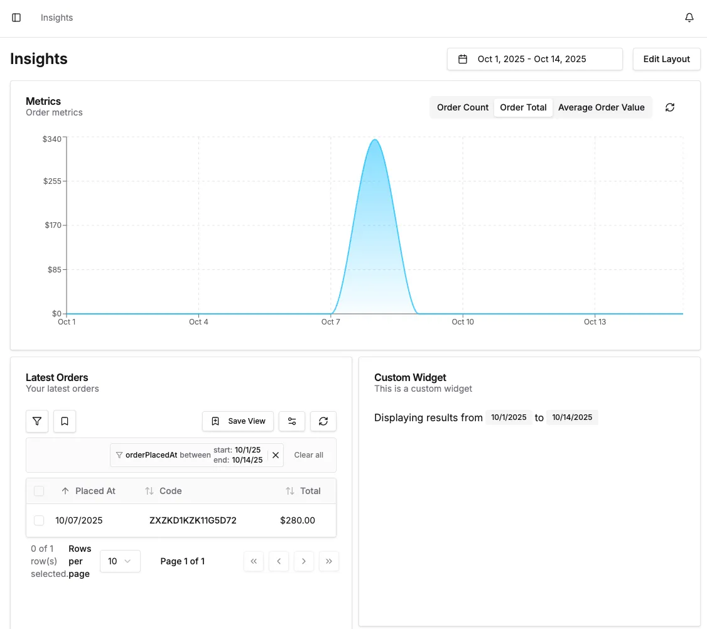

The "Insights" page can be extended with custom widgets which are used to display charts, metrics or other information that can
be useful for administrators to see at a glance.

## Example

Here's an example of a custom widget:

```tsx title="custom-widget.tsx"
import { Badge, DashboardBaseWidget, useLocalFormat, useWidgetFilters } from '@vendure/dashboard';

export function CustomWidget() {
    const { dateRange } = useWidgetFilters();
    const { formatDate } = useLocalFormat();
    return (
        <DashboardBaseWidget id="custom-widget" title="Custom Widget" description="This is a custom widget">
            <div className="flex flex-wrap gap-1">
                <span>Displaying results from</span>
                <Badge variant="secondary">{formatDate(dateRange.from)}</Badge>
                <span>to</span>
                <Badge variant="secondary">{formatDate(dateRange.to)}</Badge>
            </div>
        </DashboardBaseWidget>
    );
}
```

Always wrap your custom widget in the `DashboardBaseWidget` component, which ensures that it will render correctly
in the Insights page.

Use the `useWidgetFilters()` hook to get the currently-selected date range, if your widget depends on that.

## Refreshing widget data

The Insights page has a single **Refresh** button in its action bar, and it also auto-refreshes on
an interval while the tab is open (paused while the tab is hidden and while the layout is being
edited). Both invalidate every React Query whose `queryKey` starts with the shared
`INSIGHTS_WIDGET_QUERY_KEY` prefix. To opt your widget into these page-level refreshes, prefix your
widget's `queryKey` with it:

```tsx title="custom-widget.tsx"
import { DashboardBaseWidget, INSIGHTS_WIDGET_QUERY_KEY, useWidgetFilters } from '@vendure/dashboard';
import { useQuery } from '@tanstack/react-query';

export function CustomWidget() {
    const { dateRange } = useWidgetFilters();
    const { data } = useQuery({
        // Prefix the key so the page-level refresh button and the polling interval both refetch
        // this widget. The key stays stable, so refreshing refetches in place (your data stays on
        // screen) instead of blanking to a spinner.
        queryKey: [INSIGHTS_WIDGET_QUERY_KEY, 'my-widget', dateRange],
        queryFn: () => fetchMyWidgetData(dateRange),
    });
    return <DashboardBaseWidget id="custom-widget" title="Custom Widget">{/* ... */}</DashboardBaseWidget>;
}
```

This keeps refreshing explicit and per-widget: the dashboard deliberately does not refetch on
window focus, so a widget whose key omits the prefix simply won't participate in page-level
refreshes.

:::note[Be honest about sampled data]
Some data cannot be aggregated or sorted efficiently by the API (for example, best sellers or
low-stock variants), so a widget may only inspect a bounded sample (e.g. the most recent 100
orders, or the first 100 variants) rather than the full data set. When your widget samples,
state the basis in its `description` (or a footer) and avoid absolute claims. The built-in
**Top Products** and **Low Stock** widgets follow this: Top Products aggregates only orders in
the active channel's default currency from the most recent 100 placed orders, and Low Stock
reports "No low stock in this sample" rather than "Stock levels look healthy" so a low-stock
variant outside the sample is not misread as absent.
:::

Then register your widget in your dashboard entrypoint file using the `insights` object:

```tsx title="index.tsx"
import { defineDashboardExtension } from '@vendure/dashboard';

import { CustomWidget } from './custom-widget';

defineDashboardExtension({
    insights: {
        widgets: [
            {
                id: 'custom-widget',
                name: 'Custom Widget',
                component: CustomWidget,
                defaultSize: { w: 3, h: 3 },
            },
        ],
    },
});
```

Your widget should now be available on the Insights page:



:::info[Deprecation notice]
The top-level `widgets` option is deprecated in favour of `insights.widgets`. It still works and
is merged with `insights.widgets`, but will be removed in the next major version.
:::

## Excluding widgets

You can completely remove a widget from the Insights page, including built-in widgets or widgets
registered by other plugins, using `insights.excludeWidgets`. Excluded widgets are never rendered
and never appear in the widget picker, and this cannot be overridden by a user setting.

```tsx title="index.tsx"
import { defineDashboardExtension } from '@vendure/dashboard';

defineDashboardExtension({
    insights: {
        excludeWidgets: ['latest-orders-widget'],
    },
});
```

Exclusion is order-independent: it applies whether the excluded widget is registered before or
after the exclusion is declared.

## Persisting widget config

Widgets can store arbitrary configuration that survives a page reload and is scoped to the
individual user. Declare the defaults with `defaultConfig` on the widget definition, then read
and update the effective config inside your widget component with the `useWidgetConfig()` hook.

The effective config returned by the hook is your `defaultConfig` merged with any per-instance
overrides the user has persisted. The setter merges a partial update and persists it immediately,
independently of the "Save Layout" action.

```tsx title="custom-widget.tsx"
import { DashboardBaseWidget, useWidgetConfig } from '@vendure/dashboard';

interface CustomWidgetConfig extends Record<string, unknown> {
    unit: 'metric' | 'imperial';
}

export function CustomWidget() {
    const [config, setConfig] = useWidgetConfig<CustomWidgetConfig>();
    return (
        <DashboardBaseWidget id="custom-widget" title="Custom Widget">
            <button onClick={() => setConfig({ unit: config.unit === 'metric' ? 'imperial' : 'metric' })}>
                Unit: {config.unit}
            </button>
        </DashboardBaseWidget>
    );
}
```

```tsx title="index.tsx"
defineDashboardExtension({
    insights: {
        widgets: [
            {
                id: 'custom-widget',
                name: 'Custom Widget',
                component: CustomWidget,
                defaultSize: { w: 3, h: 3 },
                defaultConfig: { unit: 'metric' },
            },
        ],
    },
});
```

A widget without a `defaultConfig` still works: the hook returns an empty object and any overrides
you persist are stored per instance.

## Multiple instances

By default a widget can appear on the Insights page at most once. Set `allowMultipleInstances: true`
on the widget definition to let the user add it several times. Each instance keeps its own
independent layout and `useWidgetConfig()` state, so combined with persisted config you can, for
example, show the same chart widget twice with different data selections.

```tsx title="index.tsx"
defineDashboardExtension({
    insights: {
        widgets: [
            {
                id: 'custom-widget',
                name: 'Custom Widget',
                component: CustomWidget,
                defaultSize: { w: 3, h: 3 },
                defaultConfig: { unit: 'metric' },
                allowMultipleInstances: true,
            },
        ],
    },
});
```

In edit mode, multi-instance widgets are always offered in the "Add widget" picker, even when an
instance is already on the page, and each click adds a fresh instance at the next free grid slot.
Removing one instance leaves the others untouched; removing the last instance hides the widget just
like a single-instance widget.

## Global filters

Alongside the built-in date range picker, you can register your own global filters via
`insights.filters`. A filter renders a component in the Insights page action bar, and its value is
shared with **every** widget on the page. This lets several widgets filter on a common constraint,
for example a selected warehouse or sales channel.

A filter definition has an `id`, a `component`, and an optional `defaultValue`. The component is a
controlled input: it receives the current `value` and an `onChange` callback.

```tsx title="warehouse-filter.tsx"
import { Select, SelectContent, SelectItem, SelectTrigger, SelectValue } from '@vendure/dashboard';

const warehouses = { all: 'All warehouses', north: 'North', south: 'South' };

export function WarehouseFilter({ value, onChange }: { value: string; onChange: (v: string) => void }) {
    return (
        <Select value={value} onValueChange={onChange} items={warehouses}>
            <SelectTrigger className="w-48">
                <SelectValue />
            </SelectTrigger>
            <SelectContent>
                {Object.entries(warehouses).map(([id, label]) => (
                    <SelectItem key={id} value={id}>
                        {label}
                    </SelectItem>
                ))}
            </SelectContent>
        </Select>
    );
}
```

Register it in your dashboard entrypoint:

```tsx title="index.tsx"
import { defineDashboardExtension } from '@vendure/dashboard';

import { WarehouseFilter } from './warehouse-filter';

defineDashboardExtension({
    insights: {
        filters: [
            {
                id: 'warehouse',
                defaultValue: 'all',
                component: WarehouseFilter,
            },
        ],
    },
});
```

Any widget can then read the current value via the `useWidgetFilters()` hook, using the filter's
`id` as the key on `filters`:

```tsx title="custom-widget.tsx"
import { DashboardBaseWidget, useWidgetFilters } from '@vendure/dashboard';

export function CustomWidget() {
    const { dateRange, filters } = useWidgetFilters();
    const warehouse = filters.warehouse as string;
    return (
        <DashboardBaseWidget id="custom-widget" title="Custom Widget">
            <span>Showing data for warehouse: {warehouse}</span>
        </DashboardBaseWidget>
    );
}
```

Changing a filter re-renders every consuming widget. Filter state is session-only: it is not
persisted across reloads. Filter ids must be unique; registering two filters with the same id logs a
warning and ignores the duplicate.
