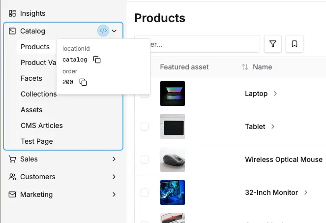
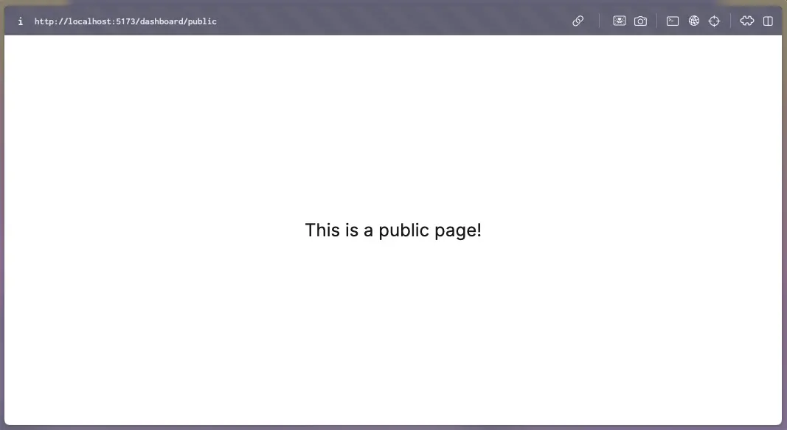

The dashboard provides a flexible navigation system that allows you to add custom navigation sections and menu items. Navigation items are organized into sections that can be placed in either the "Platform" (top) or "Administration" (bottom) areas of the sidebar.

## Adding Navigation Items to Existing Sections

The simplest way to add navigation is to add menu items to existing sections. This is done automatically when you define routes with `navMenuItem` properties.

```tsx title="src/plugins/my-plugin/dashboard/index.tsx"
import { defineDashboardExtension } from '@vendure/dashboard';

defineDashboardExtension({
    routes: [
        {
            path: '/my-custom-page',
            component: () => <div>My Custom Page</div>,
            navMenuItem: {
                // The section where this item should appear
                sectionId: 'catalog',
                // Unique identifier for this menu item
                id: 'my-custom-page',
                // Display text in the navigation
                title: 'My Custom Page',
                // Optional: URL if different from path
                url: '/my-custom-page',
            },
        },
    ],
});
```

### Available Section IDs

The dashboard comes with several built-in sections that can receive route `navMenuItem` entries:

- **`catalog`** - For product-related functionality
- **`sales`** - For order management
- **`customers`** - For customer management
- **`marketing`** - For promotions and marketing tools
- **`settings`** - For configuration and admin settings
- **`system`** - For system tools such as the job queue and scheduled tasks

The Insights entry has the ID `insights`, but it is a top-level navigation item, not a section with child items. Do not use `insights` as a route `navMenuItem.sectionId`.

### Finding Section IDs & Ordering

You can find the available IDs & their order value for all navigation sections and items using [Dev mode](/extending-the-dashboard/extending-overview/#dev-mode):



## Creating Custom Navigation Sections

You can create entirely new navigation sections with their own icons and ordering:

```tsx title="src/plugins/my-plugin/dashboard/index.tsx"
import { defineDashboardExtension } from '@vendure/dashboard';
import { FileTextIcon, SettingsIcon } from 'lucide-react';

defineDashboardExtension({
    // Define custom navigation sections
    navSections: [
        {
            id: 'content-management',
            title: 'Content',
            icon: FileTextIcon,
            placement: 'top', // Platform area
            order: 350, // After Sales (300), before Customers (400)
        },
        {
            id: 'integrations',
            title: 'Integrations',
            icon: SettingsIcon,
            placement: 'bottom', // Administration area
            order: 150, // Between System (100) and Settings (200)
        },
    ],
    routes: [
        {
            path: '/articles',
            component: () => <div>Articles</div>,
            navMenuItem: {
                sectionId: 'content-management', // Use our custom section
                id: 'articles',
                title: 'Articles',
            },
        },
        {
            path: '/pages',
            component: () => <div>Pages</div>,
            navMenuItem: {
                sectionId: 'content-management',
                id: 'pages',
                title: 'Pages',
            },
        },
    ],
});
```

For documentation on all the configuration properties available, see the reference docs:

- [DashboardNavSectionDefinition](/reference/dashboard/extensions-api/navigation#dashboardnavsectiondefinition)
- [NavMenuItem](/reference/dashboard/extensions-api/navigation#navmenuitem)

## Section Placement and Ordering

The navigation sidebar is divided into two areas:

- **Top Placement (`'top'`)**: The "Platform" area for core functionality (Dashboard, Catalog, Sales, etc.)
- **Bottom Placement (`'bottom'`)**: The "Administration" area for system and configuration sections (System, Settings)

### Placement Examples

```tsx
defineDashboardExtension({
    navSections: [
        {
            id: 'reports',
            title: 'Reports',
            icon: BarChartIcon,
            placement: 'top', // Appears in Platform area
            order: 150, // Positioned within top sections
        },
        {
            id: 'integrations',
            title: 'Integrations',
            icon: PlugIcon,
            placement: 'bottom', // Appears in Administration area
            order: 150, // Positioned within bottom sections
        },
    ],
});
```

### Order Scoping

:::important Order Scoping
Order values are scoped within each placement area. This means:

- Top sections compete only with other top sections for positioning
- Bottom sections compete only with other bottom sections for positioning
- You can use the same order value in both top and bottom without conflict
  :::

### Default Top-Level Orders

**Top Placement (Platform):**

- Insights: 100
- Catalog: 200
- Sales: 300
- Customers: 400
- Marketing: 500

**Bottom Placement (Administration):**

- Settings: 100
- System: 200

This means if you want to add a section between Catalog and Sales in the top area, you might use `order: 250`. If you want to add a section between Settings and System in the bottom area, you could use `order: 150`.

:::note[Default Placement]
If you don't specify a `placement`, sections default to `'top'` placement.
:::

## Modifying Existing Navigation

The `navSections` property can also be a function. Use this form when you need full control over the existing navigation structure, including moving, removing, renaming, or reordering built-in sections and items. It runs once, at registration time, so it cannot depend on who is logged in. For changes that vary per user, see [User-Aware Navigation](#user-aware-navigation) below.

The function receives the fully registered navigation config after all array-form `navSections` and route `navMenuItem` registrations have been applied. Return a new config object rather than mutating the input.

### Remove a built-in item

```tsx title="src/plugins/my-plugin/dashboard/index.tsx"
import { defineDashboardExtension } from '@vendure/dashboard';

defineDashboardExtension({
    navSections: config => ({
        sections: config.sections.map(section => {
            if (section.id === 'settings' && 'items' in section) {
                return {
                    ...section,
                    items: section.items?.filter(item => item.id !== 'administrators'),
                };
            }
            return section;
        }),
    }),
});
```

### Move items into a new section

```tsx title="src/plugins/my-plugin/dashboard/index.tsx"
import { defineDashboardExtension } from '@vendure/dashboard';
import { KeyRoundIcon } from 'lucide-react';
import type { NavMenuConfig } from '@vendure/dashboard';

defineDashboardExtension({
    navSections: (config: NavMenuConfig): NavMenuConfig => {
        const idsToMove = ['administrators', 'roles'];
        const settingsSection = config.sections.find(section => section.id === 'settings');
        const settingsItems =
            settingsSection && 'items' in settingsSection ? (settingsSection.items ?? []) : [];

        return {
            sections: [
                ...config.sections.map(section => {
                    if (section.id === 'settings' && 'items' in section) {
                        return {
                            ...section,
                            items: section.items?.filter(item => !idsToMove.includes(item.id)),
                        };
                    }
                    return section;
                }),
                {
                    id: 'access',
                    title: 'Access',
                    icon: KeyRoundIcon,
                    placement: 'bottom',
                    order: 150,
                    items: settingsItems.filter(item => idsToMove.includes(item.id)),
                },
            ],
        };
    },
});
```

### Rename a section

```tsx
defineDashboardExtension({
    navSections: config => ({
        sections: config.sections.map(section =>
            section.id === 'catalog' ? { ...section, title: 'Products' } : section,
        ),
    }),
});
```

Use [Dev Mode](/extending-the-dashboard/extending-overview/#dev-mode) or the [Extension Targets reference](/extending-the-dashboard/customizing-pages/extension-targets/#navigation-section-ids) to find built-in navigation IDs.

## User-Aware Navigation

The `navSections` function form above runs once, when your extension is registered. It has no access to the logged-in administrator, so it cannot be used to show different navigation to different users. For that, use `navMenuTransforms` or the `isVisible` predicate. Both receive a [DashboardUserContext](/reference/dashboard/extensions-api/navigation#dashboardusercontext) describing the current administrator.

### Per-user changes with navMenuTransforms

A [NavMenuTransform](/reference/dashboard/extensions-api/navigation#navmenutransform) receives the whole nav config plus the user context and returns a new config. Transforms run on every nav render, and they compose: each one receives the previous one's output, so several plugins can adjust the same menu without overwriting each other.

This example hides everything except a point-of-sale section from floor staff:

```tsx title="src/plugins/pos/dashboard/index.tsx"
import { defineDashboardExtension, keepOnlyNavItems } from '@vendure/dashboard';
import type { DashboardUserContext } from '@vendure/dashboard';

const isFloorStaff = (ctx: DashboardUserContext) => ctx.roles.some(role => role.code === 'floor-staff');

defineDashboardExtension({
    navMenuTransforms: [(config, ctx) => (isFloorStaff(ctx) ? keepOnlyNavItems(config, ['pos']) : config)],
});
```

[keepOnlyNavItems](/reference/dashboard/extensions-api/navigation#keeponlynavitems) hides every entry not named in the list; naming a section keeps all of its items. Prefer it, and the related [setNavVisibility](/reference/dashboard/extensions-api/navigation#setnavvisibility), over spreading `isVisible` yourself, because a plain spread silently discards a predicate that another plugin already set on the same entry.

### Conditioning your own entry with isVisible

When you only need to condition an entry you own, `isVisible` is the shorthand. It is available on nav sections and on route `navMenuItem` entries. On an item, it is ANDed with `requiresPermission`: both must pass for the item to appear. Sections are different; see the note below.

```tsx
defineDashboardExtension({
    navSections: [
        {
            id: 'reconciliation',
            title: 'Reconciliation',
            icon: BarChartIcon,
            isVisible: ctx => ctx.isSuperAdmin,
        },
    ],
});
```

On a section, returning `false` hides the section and all of its items. Note that section-level `requiresPermission` is not applied: a section is kept as long as it still has at least one visible item. Per-item `requiresPermission` still applies to the items inside.

### Roles are not channel-scoped, permissions are

`ctx.hasPermissions()` is evaluated against the active channel. `ctx.roles` is not: it lists every role the administrator holds, on any channel. If you need channel-scoped role logic, check the role's channels yourself:

```ts
const isSellerHere = (ctx: DashboardUserContext) =>
    ctx.roles.some(
        role => role.code === 'seller' && role.channels.some(c => c.id === ctx.activeChannel?.id),
    );
```

Note also that `hasPermissions()` has OR semantics despite the plural name. It returns true when the administrator holds ANY of the listed permissions on the active channel, not all of them.

### Predicates and transforms must be pure

Both run on every nav render, and the framework makes no promise about how often. Keep them pure, synchronous and cheap: do not fetch data, do not mutate the config you are handed, and do not depend on how many times you are called. The framework hands your transform a fresh top-level `sections` array, so appending or removing entries cannot damage anything. The section objects inside it are the framework's own, though: mutating a section or its `items` array in place corrupts the menu for the rest of the session. Always return new objects, as the examples above do.

### How several plugins compose

More than one plugin can adjust the same menu, and the two extension points combine differently.

`isVisible` predicates are ANDed. When `setNavVisibility` or `keepOnlyNavItems` add a predicate to an entry that already has one, both are kept and both must pass. The practical rule is that **any plugin can hide an entry and no plugin can force one to appear**. This is also why you should use those helpers rather than spreading `isVisible` yourself: a plain spread replaces whatever another plugin already set, and nothing warns you.

`navMenuTransforms` are chained in registration order, which follows the order of the `plugins` array in your Vendure config. Each transform receives the previous one's output, so where two transforms genuinely disagree about the structure, for example because both rebuild `sections`, the later one wins.

Registration and transforms happen at different times, and this trips people up. Every `navSections` entry and every route's `navMenuItem`, from every plugin, is collected before any transform runs. A transform therefore always sees the fully assembled menu, including entries contributed by plugins registered after it. Reordering the `plugins` array does not change which entries a transform can see.

One consequence is worth stating plainly. `keepOnlyNavItems` is a whitelist, so it hides entries added by other plugins just as readily as built-in ones:

```ts
// Hides 'catalog', 'sales' and so on, but also any section another plugin added.
navMenuTransforms: [(config, ctx) => (isFloorStaff(ctx) ? keepOnlyNavItems(config, ['pos']) : config)],
```

That is usually what you want for a locked-down role, since a plugin installed later cannot silently widen what the user sees. If you would rather stay open to other plugins, name their ids alongside your own, or hide the specific built-in sections with `setNavVisibility` instead of keeping only your own. The trade-off is that a section added by a future Vendure release would then be visible until you exclude it.

### This is presentation only, not authorization

None of this is an access control mechanism. Hiding a nav entry only changes what the dashboard renders. An administrator who can call an operation on the Admin API can still call it, whether or not the dashboard shows a link to it. Real access control belongs on the server, in the permissions attached to your GraphQL operations and resolvers.

### Are the built-in nav ids stable API?

The ids used throughout this guide (`catalog`, `sales`, `products`, `administrators` and the rest) are what transforms and predicates target, and in practice extensions do depend on them. They are not formally guaranteed. They are not covered by a stability policy, and a future release could rename or restructure one. Nothing will warn you when an id you targeted stops matching: the transform or predicate simply has no effect. If you rely on a built-in id, pin the dashboard version you tested against and re-check the ids after upgrading.

## Unauthenticated Routes

By default, all navigation is assumed to be for authenticated routes, i.e. the routes are only accessible to administrators
who are logged in.

Sometimes you want to make a certain route accessible to unauthenticated users. For example, you may want to implement
a completely custom login page or a password recovery page, which must be accessible to everyone.

This is done by setting `authenticated: false` in your route definition:

```tsx
import { defineDashboardExtension } from '@vendure/dashboard';

defineDashboardExtension({
    routes: [
        {
            path: '/public',
            component: () => (
                <div className="flex h-screen items-center justify-center text-2xl">
                    This is a public page!
                </div>
            ),
            authenticated: false, // [!code highlight]
        },
    ],
});
```

This page will then be accessible to all users at `http://localhost:4873/dashboard/public`



## Complete Example

Here's a comprehensive example showing how to create a complete navigation structure for a content management system:

```tsx title="src/plugins/cms/dashboard/index.tsx"
import { defineDashboardExtension } from '@vendure/dashboard';
import { FileTextIcon, ImageIcon, TagIcon, FolderIcon, SettingsIcon } from 'lucide-react';

defineDashboardExtension({
    // Create custom navigation sections
    navSections: [
        {
            id: 'content',
            title: 'Content',
            icon: FileTextIcon,
            placement: 'top', // Platform area
            order: 250, // Between Catalog (200) and Sales (300)
        },
        {
            id: 'media',
            title: 'Media',
            icon: ImageIcon,
            placement: 'top', // Platform area
            order: 275, // After Content section
        },
    ],

    routes: [
        // Content section items
        {
            path: '/articles',
            component: () => <div>Articles List</div>,
            navMenuItem: {
                sectionId: 'content',
                id: 'articles',
                title: 'Articles',
            },
        },
        {
            path: '/pages',
            component: () => <div>Pages List</div>,
            navMenuItem: {
                sectionId: 'content',
                id: 'pages',
                title: 'Pages',
            },
        },
        {
            path: '/categories',
            component: () => <div>Categories List</div>,
            navMenuItem: {
                sectionId: 'content',
                id: 'categories',
                title: 'Categories',
            },
        },

        // Media section items
        {
            path: '/media-library',
            component: () => <div>Media Library</div>,
            navMenuItem: {
                sectionId: 'media',
                id: 'media-library',
                title: 'Library',
            },
        },
        {
            path: '/media-folders',
            component: () => <div>Media Folders</div>,
            navMenuItem: {
                sectionId: 'media',
                id: 'media-folders',
                title: 'Folders',
            },
        },

        // Add to existing settings section
        {
            path: '/cms-settings',
            component: () => <div>CMS Settings</div>,
            navMenuItem: {
                sectionId: 'settings',
                id: 'cms-settings',
                title: 'CMS Settings',
            },
        },
    ],
});
```

## Icons

The dashboard uses [Lucide React](https://lucide.dev/) icons. You can import any icon from the library:

```tsx
import {
    HomeIcon,
    ShoppingCartIcon,
    UsersIcon,
    SettingsIcon,
    FileTextIcon,
    ImageIcon,
    BarChartIcon,
    // ... any other Lucide icon
} from 'lucide-react';
```

Common icons for navigation sections:

- **Content**: `FileTextIcon`, `EditIcon`, `BookOpenIcon`
- **Media**: `ImageIcon`, `FolderIcon`, `UploadIcon`
- **Analytics**: `BarChartIcon`, `TrendingUpIcon`, `PieChartIcon`
- **Tools**: `WrenchIcon`, `SettingsIcon`, `CogIcon`
- **Integrations**: `LinkIcon`, `ZapIcon`, `PlugIcon`

## Best Practices

:::tip[Navigation Design Guidelines]

1. **Use descriptive section names**: Choose clear, concise names that indicate the section's purpose
2. **Group related functionality**: Keep logically related menu items in the same section
3. **Choose appropriate icons**: Select icons that clearly represent the section's function
4. **Consider ordering carefully**: Place frequently used sections earlier in the navigation
5. **Keep section counts reasonable**: Avoid creating too many sections as it can clutter the navigation
6. **Use consistent naming**: Follow consistent patterns for menu item names within sections
   :::
